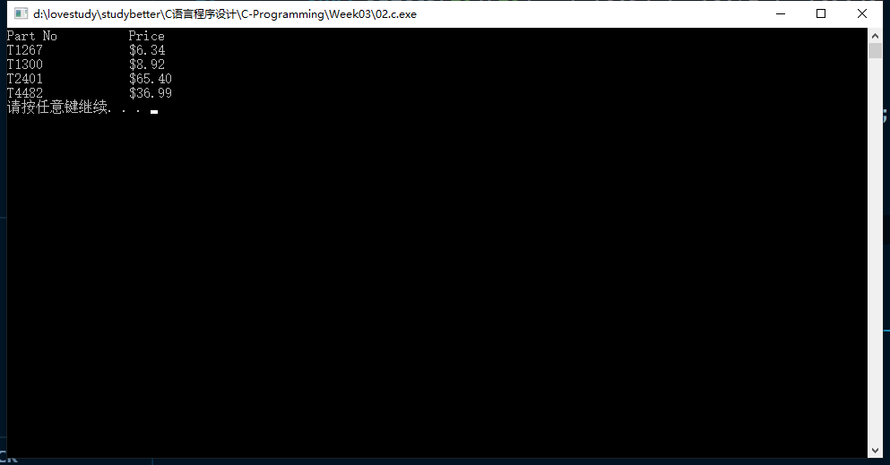
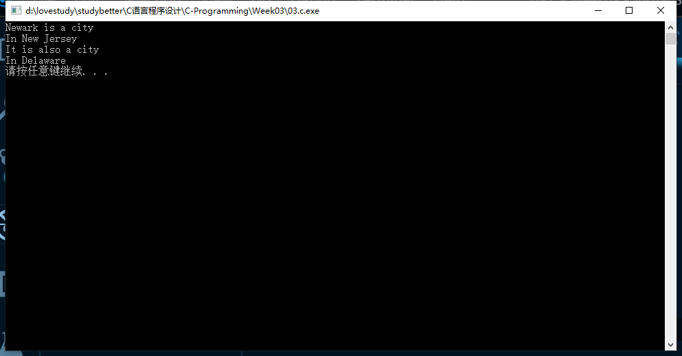
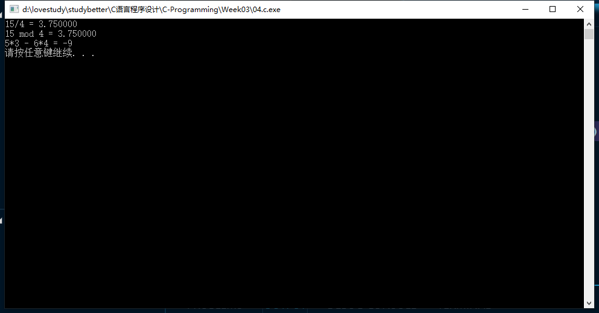
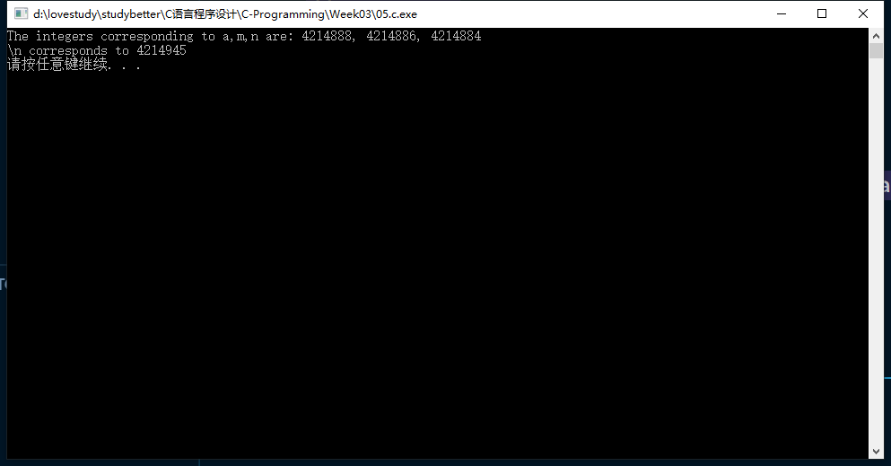
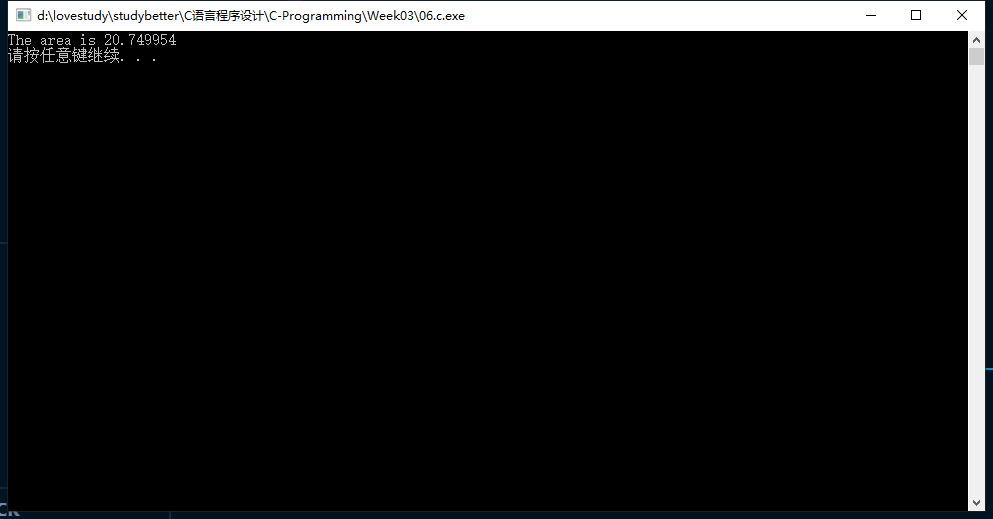
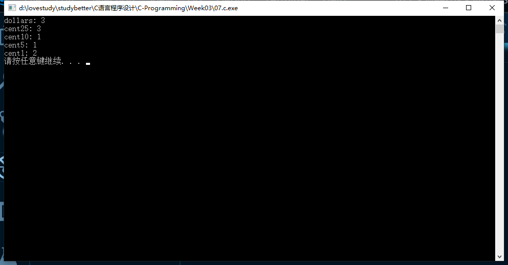
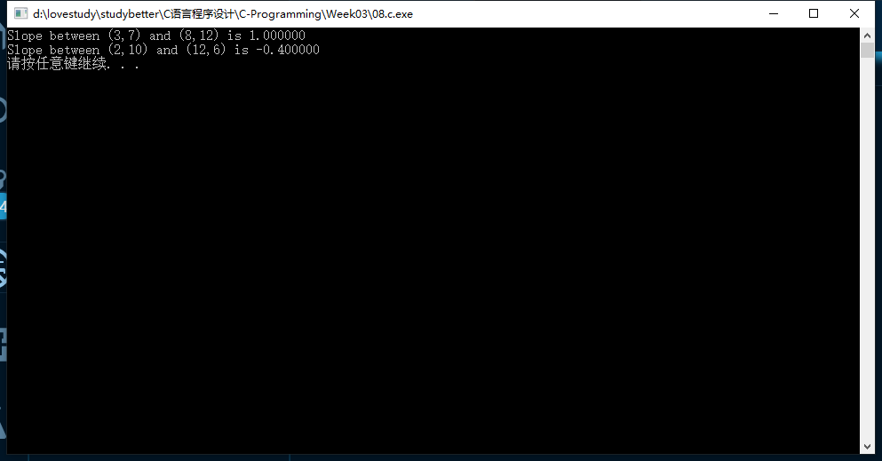

# 第三次作业-17377191-段秋阳

## 1.C-alert

```c
//alert sound

#include <stdio.h>
#include <stdlib.h>

int main()
{
    printf("\a");
    system("pause");
    return 0;
}
```


## 2.Print Info

```c
//P39 2.1:print info

#include <stdio.h>
#include <stdlib.h>
#include <string.h>

int main()
{
    char parts[10][10] = {"T1267", "T1300", "T2401", "T4482"};
    char prices[10][10] = {"$6.34", "$8.92", "$65.40", "$36.99"};
    printf("Part No \t Price \n");
    for (int i = 0; i < 4; i++)
    {
        printf("%s \t\t %s \n", parts[i], prices[i]);
    }
    system("pause");
    return 0;
}
```



## 3.Prettify The Code

```c
//P43 2.2: Q2
#include <stdio.h>
#include <stdlib.h>

int main()
{
    printf("Newark is a city\n");
    printf("In New Jersey\n");
    printf("It is also a city\n");
    printf("In Delaware\n");

    system("pause");
    return 0;
}
```



## 4.Calculate

```c
//P58 2.4: Q4

#include <stdio.h>
#include <stdlib.h>

int main()
{
    printf("15/4 = %f\n", 15.0 / 4.0);
    printf("15 mod 4 = %f\n", 15 % 4);

    printf("5*3 - 6*4 = %d\n", 5 * 3 - 6 * 4);

    system("pause");
    return 0;
}

```



## 5.Convert letters to numbers

```c
//P58 2.4:Q5
#include <stdio.h>
#include <stdlib.h>

int main()
{
    printf("The integers corresponding to a,m,n are: %d, %d, %d\n", "a", "m", "n");
    printf("\\n corresponds to %d\n", "\n");

    system("pause");
    return 0;
}
```



## 6.Caculate the area of a circle

```c
//P65 2.5: Q2

#include <stdio.h>
#include <stdlib.h>
#include <math.h>

#define PI 3.1416

int main()
{
    double radius = 2.57;
    double area = PI * radius * radius;
    printf("The area is %f\n", area);

    system("pause");
    return 0;
}
```



## 7.Dollars and Cents

```c
//P66 2.5: 6(a)

#include <stdio.h>
#include <stdlib.h>

int main()
{
    float paid = 10.00;
    float check = 6.07;

    int change = (paid - check) * 100; //cents
    int dollars = change / 100;        //dollars -> 100cents

    int cent25 = (change - 100 * dollars) / 25;
    int cent10 = (change - 100 * dollars - 25 * cent25) / 10;
    int cent5 = (change - 100 * dollars - 25 * cent25 - 10 * cent10) / 5;
    int cent1 = (change - 100 * dollars - 25 * cent25 - 10 * cent10 - 5 * cent5);

    printf("dollars: %d\n", dollars);
    printf("cent25: %d\n", cent25);
    printf("cent10: %d\n", cent10);
    printf("cent5: %d\n", cent5);
    printf("cent1: %d\n", cent1);

    system("pause");
    return 0;
}
```



## 8.Slope

```c
//P69 2.6: Q7
#include <stdio.h>
#include <stdlib.h>

float getSlope(float x1, float y1, float x2, float y2)
{
    if (x1 == x2)
        printf("Slope doesn't exist");
    else
        return (y2 - y1) / (x2 - x1);
}

int main()
{
    float x1 = 3.0, y1 = 7.0, x2 = 8.0, y2 = 12.0;
    float slope = getSlope(x1, y1, x2, y2);
    printf("Slope between (3,7) and (8,12) is %f\n", slope);

    x1 = 2.0, y1 = 10.0, x2 = 12.0, y2 = 6.0;
    slope = getSlope(x1, y1, x2, y2);
    printf("Slope between (2,10) and (12,6) is %f\n", slope);

    system("pause");
    return 0;
}
```

