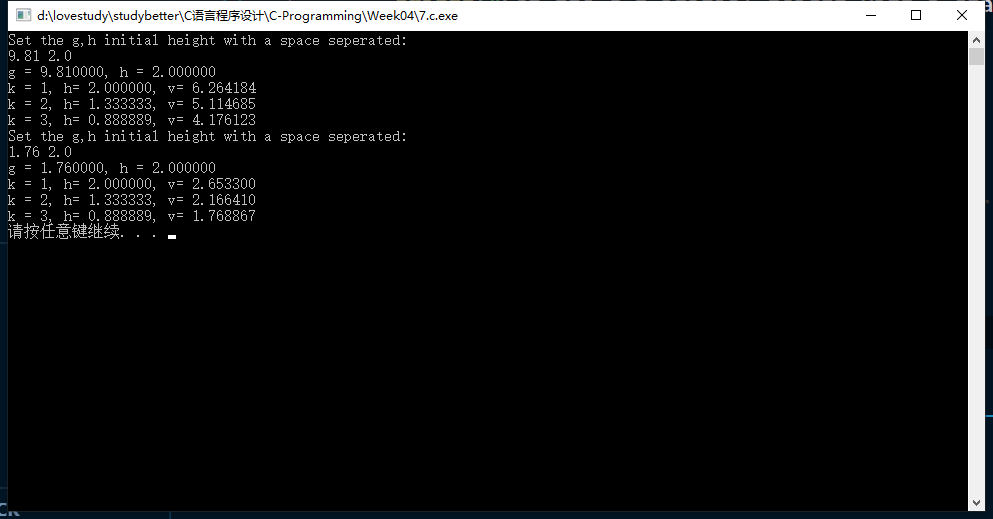

# 第四次-17377191-段秋阳

## 1. P87, 3.1简答题 3 （编写程序进行验证）

```c
//P87 3.1: Q3
#include <stdio.h>
#include <stdlib.h>

int main()
{
    int a, b;
    a = 100;
    b = 0;

    //printf("%d", a - b = 25);(Invalid)
    printf("%d\n", a - (b = 25));
    system("pause");
    return 0;
}
```

## 2. P115, 编程题 4

```c
//P115 Q4
#include <stdio.h>
#include <stdlib.h>

int main()
{
    int x1, y1, x2, y2;
    for (int i = 0; i < 3; i++)
    {
        printf("Input x1,y1,x2,y2 with spaces seperated: \n");
        scanf("%d %d %d %d", &x1, &y1, &x2, &y2);
        printf("x1=%d, y1=%d, x2=%d, y2=%d \n", x1, y1, x2, y2);
        printf("The middle point is (%d,%d)\n", (x1 + x2) / 2, (y1 + y2) / 2);
    }

    system("pause");
    return 0;
}
```


## 3. P116, 编程题 5

```c
//P116 Q5
#include <stdio.h>
#include <stdlib.h>
#include <math.h>

int main()
{
    double num;
    while (1)
    {
        printf("Input a positive number:\n");
        scanf("%lf", &num);
        printf("The 4-times square root is %lf\n", pow(num, 0.25));
    }

    return 0;
}
```


## 4. P116, 编程题 6

```c
//P116 Q6
#include <stdio.h>
#include <stdlib.h>
#include <math.h>

double Interest(double X, int N, double R)
{
    //The annual interest rate is %R
    double A = X * pow(1.0 + R / 100, N);
    return A;
}

int main()
{
    double R, X, A;
    int N;
    while (1)
    {
        printf("Enter the amount of the initial deposit:\n");
        scanf("%lf", &X);
        printf("Enter the number of years:\n");
        scanf("%d", &N);
        printf("Enter the annual interest rate:\n");
        scanf("%lf", &R);

        A = Interest(X, N, R);
        printf("The compound interest is %lf\n\n", A);
    }

    return 0;
}
```

## 5. P116, 编程题 7

```c
//P116 Q7
#include <stdio.h>
#include <stdlib.h>

#define TEXRATE 0.06

int main()
{
    double price, discount;
    int num;

    printf("Enter the price, amount and discount rate with spaces seperated\n");
    scanf("%lf %d %lf", &price, &num, &discount);

    double total = num * price;
    double discounted_total = total * (1 - discount);
    double tax = total * TEXRATE;
    double money = total + tax;

    printf("total: %lf\n", total);
    printf("discounted total: %lf\n", discounted_total);
    printf("Tax: %lf\n", tax);
    printf("Money should be paid:%lf \n", money);

    return 0;
}
```

## 6. P116, 编程题 8

```c
//P116 Q8
#include <stdio.h>
#include <stdlib.h>
#include <math.h>

int distance(int x, int y)
{
    double dist = sqrt(x * x + y * y);

    if (dist - (int)(dist) < 0.5)
        return (int)(dist);
    else
        return (int)(dist) + 1;
}

int main()
{
    int x, y;
    printf("Enter x,y with a space seperated:\n");
    scanf("%d %d", &x, &y);
    int dist = distance(x, y);
    printf("The distance is %d\n", dist);

    system("pause");
    return 0;
}
```

## 7. P116, 编程题 9

```c
//P117 Q9
#include <stdio.h>
#include <stdlib.h>
#include <math.h>

double FreeFall(double height, double g)
{
    double velocity = sqrt(2 * g * height);
    return velocity;
}

int main()
{
    double g, h;
    for (int j = 0; j < 2; j++)
    {
        printf("Set the g,h initial height with a space seperated:\n");
        scanf("%lf %lf", &g, &h);
        printf("g = %lf, h = %lf \n", g, h);

        for (int i = 1; i <= 3; i++)
        {
            printf("k = %d, h= %lf, v= %lf\n", i, h, FreeFall(h, g));
            h = 2.0 / 3.0 * h;
        }
    }

    system("pause");
    return 0;
}
```



## 8. 编写一个程序，要求用户输入一个3位数，然后按数位的逆序打印出这个数（想想scanf能不能做到）

```c
#include <stdio.h>
#include <stdlib.h>

int main()
{
    char num[3];
    printf("Enter a 3-digit number:\n");
    scanf("%s", num);
    for (int i = 2; i >= 0; i--)
    {
        printf("%c", num[i]);
    }

    system("pause");
    return 0;
}
```

