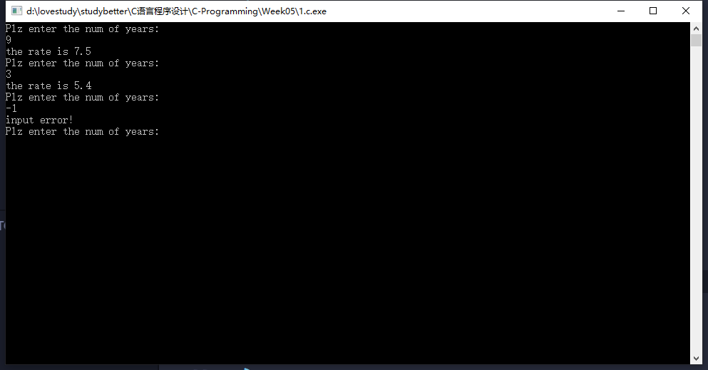
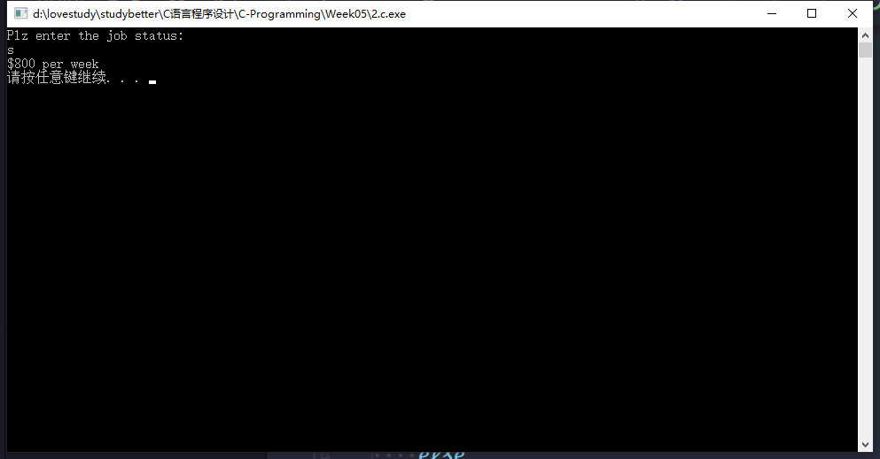
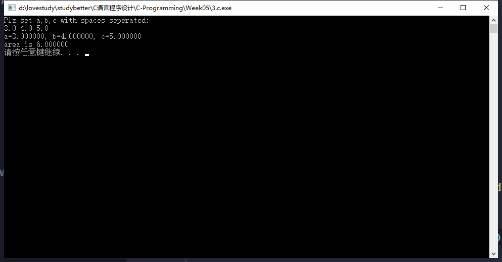
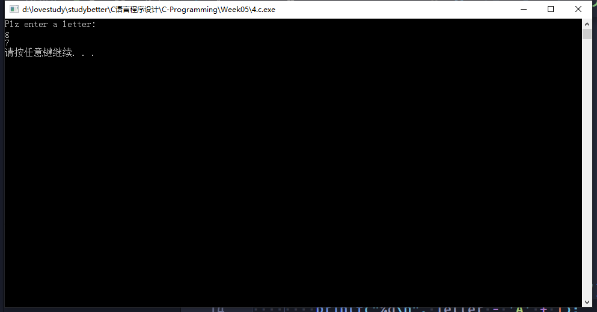
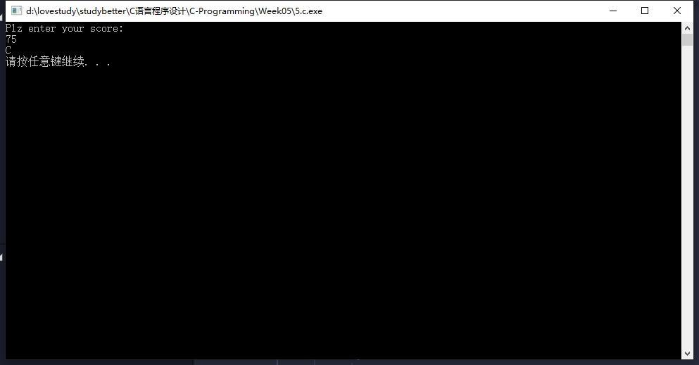
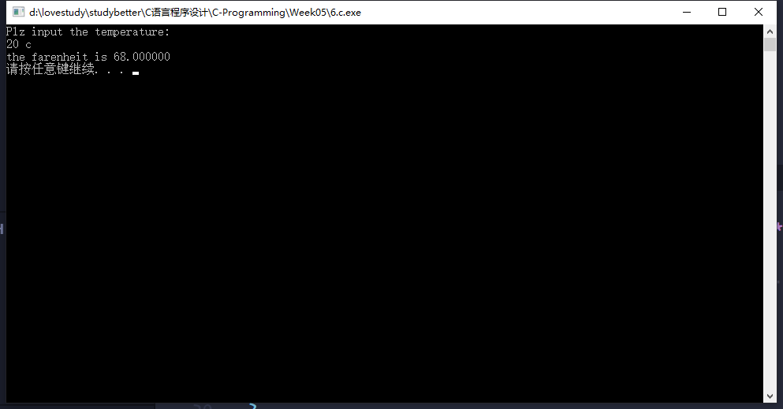
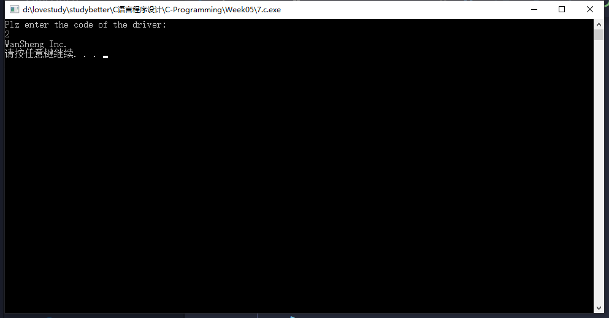
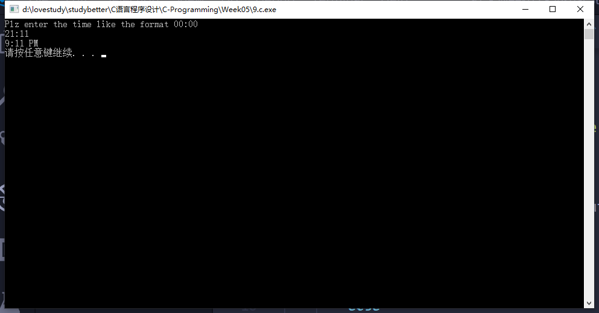

# 第五次-17377191-段秋阳

## 1. P138, 1

```c
// P138,Q1
#include <stdio.h>
#include <stdlib.h>

int main()
{
    while (1)
    {
        int numYrs;
        printf("Plz enter the num of years:\n");
        scanf("%d", &numYrs);

        if (numYrs > 5)
            printf("the rate is 7.5%\n");
        else if (numYrs >= 0 && numYrs <= 5)
            printf("the rate is 5.4%\n");
        else
            printf("input error!\n");
    }
    system("pause");
    return 0;
}
```



## 2. P139, 4

```c
//P139 Q4
#include <stdio.h>
#include <stdlib.h>

int main()
{

    char status;
    printf("Plz enter the job status:\n");
    status = getchar();

    if (status == 's')
        printf("$800 per week\n");
    else
        printf("$375 per week\n");

    system("pause");
    return 0;
}
```



## 3. P139, 6

```c
//P139:Q6
#include <stdio.h>
#include <stdlib.h>
#include <math.h>

double calc_area(double a, double b, double c)
{
    double area;
    double s = (a + b + c) / 2;
    double t = s * (s - a) * (s - b) * (s - c);

    if (t < 0)
    {
        printf("not a triangle");
        return -1;
    }
    else
    {
        area = sqrt(t);
        return area;
    }
}

int main()
{
    double a, b, c;
    printf("Plz set a,b,c with spaces seperated:\n");
    scanf("%lf %lf %lf", &a, &b, &c);
    printf("a=%lf, b=%lf, c=%lf\n", a, b, c);
    printf("area is %lf\n", calc_area(a, b, c));

    system("pause");
    return 0;
}
```



## 4. P139, 8

```c
//P139:Q8
#include <stdio.h>
#include <stdlib.h>

int main()
{
    char letter;
    printf("Plz enter a letter:\n");
    scanf("%c", &letter);

    if (letter >= 'a' && letter <= 'z')
        printf("%d\n", letter - 'a' + 1);
    else if (letter >= 'A' && letter <= 'Z')
        printf("%d\n", letter - 'A' + 1);

    system("pause");
    return 0;
}
```



## 5. P145编程题, 1

```c
//P145:Q1
#include <stdio.h>
#include <stdlib.h>

int main()
{
    int score;
    printf("Plz enter your score:\n");
    scanf("%d", &score);

    if (score == 100)
        printf("A\n");
    else
    {
        switch ((int)(score / 10))
        {
        case 9:
        {
            printf("A\n");
            break;
        }
        case 8:
        {
            printf("B\n");
            break;
        }
        case 7:
        {
            printf("C\n");
            break;
        }
        case 6:
        {
            printf("D\n");
            break;
        }
        default:
        {
            printf("F\n");
            break;
        }
        }
    }
    system("pause");
    return 0;
}
```



## 6. P146,  3 

```c
//P146:q3
#include <stdio.h>
#include <stdlib.h>

int main()
{
    double temp;
    char type;

    printf("Plz input the temperature:\n");
    scanf("%lf %c", &temp, &type);
    if (type == 'f')
        printf("the celcius is %lf\n"), 5.0 / 9.0 * (temp - 32.0);
    else if (type == 'c')
        printf("the farenheit is %lf\n", 9.0 / 5.0 * temp + 32.0);
    else
        printf("Input err");
    system("pause");
    return 0;
}
```



## 7. P152, 1（要求用switch实现）

```c
//P152:Q1
#include <stdio.h>
#include <stdlib.h>

int main()
{
    int code;
    printf("Plz enter the code of the driver: \n");
    scanf("%d", &code);

    switch (code)
    {
    case 1:
    {
        printf("3M Inc.\n");
        break;
    }
    case 2:
    {
        printf("WanSheng Inc.\n");
        break;
    }
    case 3:
    {
        printf("Sony\n");
        break;
    }
    case 4:
    {
        printf("Weibao Inc.\n");
        break;
    }

    default:
    {
        printf("Err\n");
        break;
    }
    }

    system("pause");
    return 0;
}
```



## 9. 编写一个程序，要求用户输入24小时制时间，然后显示12小时制和格式。如输入21:11，应输出9:11 PM。注意不要把12:00显示成0:00。

```c
//24h -> 12h
#include <stdio.h>
#include <stdlib.h>
#include <string.h>

int main()
{
    int hour, minute;
    printf("Plz enter the time like the format 00:00\n");
    scanf("%d:%d", &hour, &minute);

    if (hour >= 00 && hour < 12)
        printf("%d:%02d AM\n", hour, minute);
    else if (hour == 12)
    {
        if (minute == 00)
            printf("12:00");
        else
            printf("%d:%02d AM\n", hour, minute);
    }
    else
        printf("%d:%02d PM\n", hour - 12, minute);

    system("pause");
    return 0;
}
```


[Try and check it](https://github.com/DallasAutumn/C-Programming)