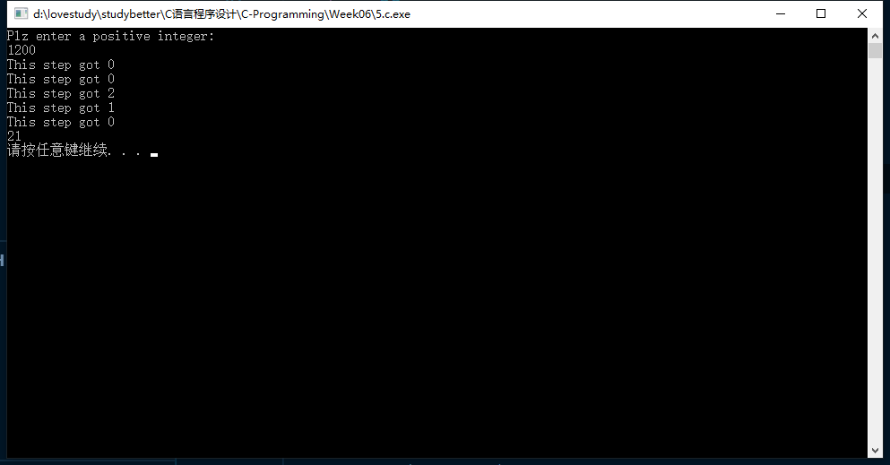

# 第六次-17377191-段秋阳

## 1. P183, 2

```c
//P183 Q2
#include <stdio.h>
#include <stdlib.h>

int main()
{
    int count, MAXCOUNT;
    float num, total;

    printf("Please type in the total number of data values to be added:\n\n");
    scanf("%d", &MAXCOUNT);

    count = 1;
    total = 0.0;

    while (count <= MAXCOUNT)
    {
        printf("Enter a number: ");
        scanf("%f", &num);
        total += num;
        printf("The total is now %f\n", total);
        count++;
    }

    printf("\n\nThe final total of the %d numbers is %f\n", MAXCOUNT, total);

    system("pause");
    return 0;
}
```


## 2. P191, 7

```c
//P191 Q7
#include <stdio.h>
#include <stdlib.h>

int main()
{
    int total = 28000, years = 7, vel = 4000, acc_dep = 0;

    printf("\t\t DEPRECIATION SCHEDULE\n");
    printf("\t\t ---------------------\n");
    printf("YEAR DEPRECIATION END-OF-YEAR-VALUE ACCUMULATED-DEPRECIATION\n");

    for (int i = 1; i <= years; i++)
    {
        total -= vel;
        acc_dep += vel;
        printf("%d\t%d\t\t%d\t\t\t%d\n", i, vel, total, acc_dep);
    }

    system("pause");
    return 0;
}
```


## 3. P198, 11

```c
//P198 11
#include <stdio.h>
#include <stdlib.h>
#include <math.h>
#define delta 0.5

int main()
{
    double v = 500.0, theta = 22.8 / 180, totalTime = 10.0, t = 0;

    while (t <= totalTime)
    {
        double x = v * t * cos(theta);
        double y = v * t * sin(theta);
        printf("t=%lfs, x=%lf ,y=%lf \n", t, x, y);
        t += delta;
    }

    system("pause");
    return 0;
}
```


## 4. P202, 5

```c
//P202 5
#include <stdio.h>
#include <stdlib.h>
#include <math.h>

#define DUE 10
#define COUNT 7
#define delta 0.01

int main()
{
    double init = 1000.0;

    for (int i = 0; i < COUNT; i++) //Outer loop 7
    {
        double rate = 0.06 + i * delta;
        printf("rate:%lf", rate);

        for (int year = 1; year <= DUE; year++) //Inner loop 10
        {
            printf("\t %lf", init * pow(1 + rate, year));
        }

        printf("\n");
    }

    system("pause");
    return 0;
}
```


## 5. P205, 3

```c
//P205 3
#include <stdio.h>
#include <stdlib.h>
#define MAXLEN 20

int main()
{
    int res[MAXLEN];
    int num, q, r, top = -1;
    printf("Plz enter a positive integer:\n");
    scanf("%d", &num);

    if (num <= 0)
    {
        printf("Error!\n");
        return -1;
    }
    else
    {
        do
        {
            r = num % 10;
            printf("This step got %d\n", r);
            num = (int)(num / 10);
            res[++top] = r;
        } while (!(r == 0 && num == 0));
    }

    for (int i = 0; i < top; i++)
    {
        if (res[i] != 0)
            printf("%d", res[i]);
    }

    printf("\n");
    system("pause");
    return 0;
}
```




## 6. 编写程序，找出用户输入一串数中的最大数和最小数。程序需要提示用户一个一个地输入数，当用户输入0或负数时，程序停止输入，并显示已输入的最大非负数和最小非负数。注意：输入的数不一定是整数。

```c
//Find max and min
#include <stdio.h>
#include <stdlib.h>
#define MAXLEN 100

int main()
{
    float nums[MAXLEN];
    int i = 0;
    float num, max, min;

    do
    {
        printf("Plz enter a number:\n");
        scanf("%f", &num);
        if (num > 0)
        {
            nums[i] = num;
            i++;
        }
    } while (num > 0);

    if (nums != NULL)
    {
        max = nums[0], min = nums[0];
    }
    else
    {
        printf("Empty!\n");
        return -1;
    }

    for (int j = 0; j < i; j++)
    {
        double temp = nums[j];
        if (temp > max)
            max = temp;
        if (temp < min)
            min = temp;
    }

    printf("max = %f, min=%f\n", max, min);

    system("pause");
    return 0;
}
```


## 7. 编写程序，要求用户输入一个分数，然后将其约为最简形式。如输入6/12，输出1/2；输入12/6，输出2。提示：先计算出分子、分母的最大公约数。

```c
//Simplify fraction
#include <stdio.h>
#include <stdlib.h>

int MaxPrime(int, int);

int main()
{
    int numerator, denominator;
    printf("plz enter a fraction:\n");
    scanf("%d/%d", &numerator, &denominator);

    if (denominator == 0)
    {
        printf("Input error!\n");
        return -1;
    }

    int prime = MaxPrime(numerator, denominator);
    numerator /= prime;
    denominator /= prime;

    if (denominator == 1)
        printf("%d\n", numerator);
    else
        printf("%d/%d\n", numerator, denominator);

    system("pause");
    return 0;
}

int MaxPrime(int m, int n)
{
    int i;
    i = (m < n) ? m : n;

    while (i > 0)
    {
        if (m % i == 0 && n % i == 0)
            return i;
        i--;
    }
}
```


[Gotta try my best to finish every excercise. But C-lang is boring enough... Expecting the JAVA course in next semester! Whatever, every line of code deserves to be respected, just stick to it and keep making progress, I will.:)](https://github.com/DallasAutumn/C-Programming)