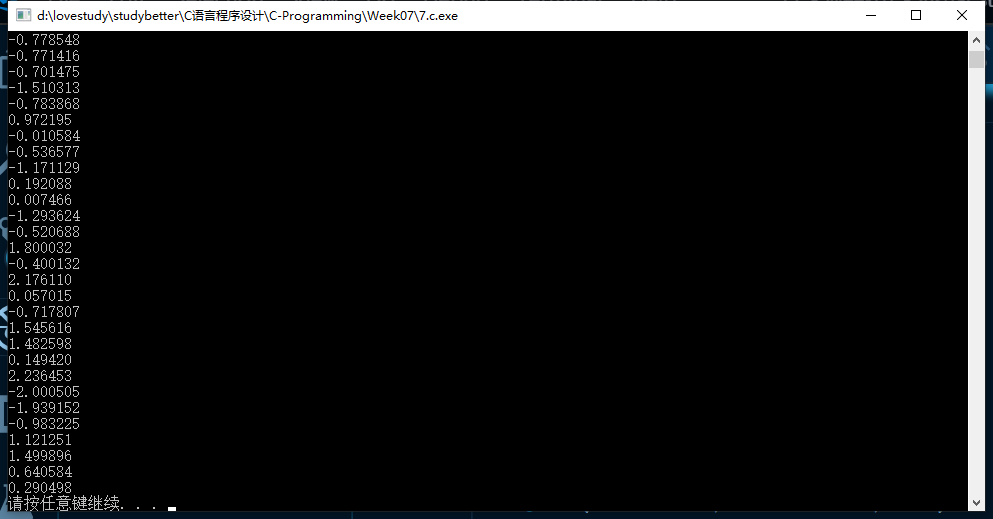

# 第七次-17377191-段秋阳

## 1. P229, 6 (主函数完成输入输出即可，注意公式的化简)；

```c
//P229 6
#include <stdio.h>
#include <stdlib.h>

int factorial(int num);
int combination(int m, int n);

int main()
{
    int m = 8, n = 3;
    printf("%d\n", combination(m, n));

    system("pause");
    return 0;
}

int factorial(int num)
{
    if (num < 0)
    {
        printf("Input error!\n");
        return -1;
    }
    else if (num == 0)
        return 1;
    else
        return num * factorial(num - 1);
}

int combination(int m, int n)
{
    if (m >= 0 && n >= 0)
        if (m < n)
        {
            printf("Input error!\n");
            return -1;
        }
        else
            return factorial(m) / (factorial(n) * factorial(m - n));
    else
    {
        printf("Input error!\n");
        return -1;
    }
}
```


## 2. 实现一个函数num_digits(n,k)，使得函数返回正整数n中的第k位数字（从右边算起）（如果k大于n所含有的数字的个数，则返回-1）并在主函数中进行测试；

```c
//num_digits(n,k)
#include <stdio.h>
#include <stdlib.h>
#include <string.h>
#define MAXDIGITS 100

int num_digits(int num, int k);

int main()
{
    int n = 12345, k = 2;
    printf("n=%d, k=%d, digit=%c\n", n, k, num_digits(n, k));
    system("pause");
    return 0;
}

int num_digits(int n, int k)
{
    char arr[MAXDIGITS];
    if (k <= n)
    {
        itoa(n, arr, 10);
        int len = strlen(arr);
        return arr[len - k];
    }
    else
        return -1;
}
```


## 3. 用C实现一个能够计算高精度的Pi值的函数并测试（找一个自己理解并喜欢的公式来计算）；

```c
#include <stdio.h>
#include <stdlib.h>
#include <math.h>
#include <time.h>
#define epsilon 1e-6 //absloute error

int main()
{
    int i = 0;
    double sum = 0, pi = 0;
    double u;
    time_t start, end;

    //start = time(NULL);

    do
    {
        u = pow(-1.0, i) / (2 * i + 1);
        sum += u;
        printf("u=%lf, sum=%lf\n", u, 4.0 * sum);
        i++;
    } while (fabs(u) > epsilon);
    pi = 4.0 * sum;

    //end = time(NULL);

    printf("pi = %.10f\n", pi);
    printf("time = %d\n", difftime(end, start));
    system("pause");
    return 0;
}
```


## 4. P248, 6；

```c
//P248 6
#include <stdio.h>
#include <stdlib.h>
#include <time.h>

void HILO();
void Retry();

int onGame = 1;

int main()
{

    do
    {
        HILO();
    } while (onGame);

    system("pause");
    return 0;
}

void HILO()
{
    int a, guess, flag = 0;

    srand(time(NULL));
    a = rand() % 100 + 1; //Initialize a random integer between 1 and 100
    printf("a = %d\n", a);

    for (int i = 7; i >= 1; i--)
    {
        printf("You have %d chances\n", i);
        scanf("%d", &guess);
        if (guess == a)
        {
            flag = 1;
            break;
        }
        if (guess > a)
        {
            printf("Wrong Number, Try Again, %d Chances Left :)\n", i - 1);
            printf("Note:Greater\n");
        }
        if (guess < a)
        {
            printf("Wrong Number, Try Again, %d Chances Left :)\n", i - 1);
            printf("Note:Smaller\n");
        }
    }
    if (flag)
        printf("Hooray, you have won!\n");
    else
        printf("Sorry, you lose. The correct answer is %d\n", a);

    Retry();
}

void Retry()
{
    char retry;

    printf("Would you like to play again (y/n)?\n");
    scanf("%c", &retry);

    if (retry == 'y')
        HILO();
    else if (retry == 'n')
    {
        printf("Exited.\n");
        onGame = 0;
    }
    else
    {
        printf("Read what I say! :(\n");
        Retry();
    }
}
```


## 5. P249, 12（了解一下当前的文本自动生成技术，以及在自动问答等方面的应用）；

```c
//P249 12
#include <stdio.h>
#include <stdlib.h>
#include <windows.h>
#include <time.h>

int inArray(char, char);

char kw[6][2] = {{'a', 't'}, {'i', 's'}, {'h', 'e'}, {'w', 'e'}, {'u', 'p'}, {'o', 'n'}};

int main()
{
    int i = 0, r = 0, temp = 0;
    srand(time(NULL));

    do
    {
        temp = r;
        r = rand() % 26 + 1;
        printf("%c", r + 96);
        i++;
        //Sleep(200);
    } while (inArray((char)(temp + 96), (char)(r + 96)) == 0);

    printf("\n");
    printf("total:%d\n", i);

    system("pause");
    return 0;
}

int inArray(char c1, char c2)
{
    for (int j = 0; j < 6; j++)
    {
        if (c1 == kw[j][0] && c2 == kw[j][1])
            return 1;
        else
            continue;
    }

    return 0;
}
```


## 6. P249,13（注意边界条件的设置）；

```c
//P249 13
#include <stdio.h>
#include <stdlib.h>
#include <time.h>
#define NightNum 500.0

int main()
{
    int count = 0;
    srand(time(NULL));

    for (int i = 1; i <= NightNum; i++)
    {
        int step = 0, r = 0;
        do
        {
            r = rand() % 100 + 1;

            if (r < 50)
                step += 2;
            else
                step -= 1;

            if (step == 0)
                break;
        } while (step < 10);

        if (step)
            count += 1;

        printf("Day%d, count=%d\n", i, count);
    }

    printf("prob = %lf\n", count / NightNum);
    system("pause");
    return 0;
}
```


## 7. 用C实现一个能够产生高斯分布随机数的函数并测试；

```c
//Gaussian Distribution
#include <stdio.h>
#include <stdlib.h>
#include <math.h>
#include <time.h>
#define MAXNUM 100
double genGaussianRand();

int main()
{
    srand(time(NULL));
    for (int i = 0; i < MAXNUM; i++)
    {
        printf("%lf\n", genGaussianRand());
    }
    system("pause");
    return 0;
}

double genGaussianRand()
{
    static double U1, U2;
    static int phase = 0;
    double Z;

    U1 = rand() * (1.0 / RAND_MAX);
    U2 = rand() * (1.0 / RAND_MAX);

    if (phase == 0)
        Z = sqrt(-2.0 * log(U1)) * sin(2.0 * M_PI * U2);
    else
        Z = sqrt(-2.0 * log(U1)) * cos(2.0 * M_PI * U2);

    phase = 1 - phase;
    return Z;
}
```



## 8. 用C实现一个能够产生产生指数分布随机数的函数并测试。

```c
//Index Distribution
#include <stdio.h>
#include <stdlib.h>
#include <math.h>
#include <time.h>
#define MAXNUM 100
#define LAMBDA 5.0

double randomExponential(double);

int main()
{
    for (int i = 0; i < MAXNUM; i++)
    {
        printf("%lf\n", randomExponential(LAMBDA));
    }
    system("pause");
    return 0;
}

double randomExponential(double lambda)
{
    double pv = 0.0;
    do
    {
        pv = (double)(rand() % 100) / 100;
    } while (pv == 0);
    pv = (-1 / lambda) * log(1 - pv);
    return pv;
}
```

