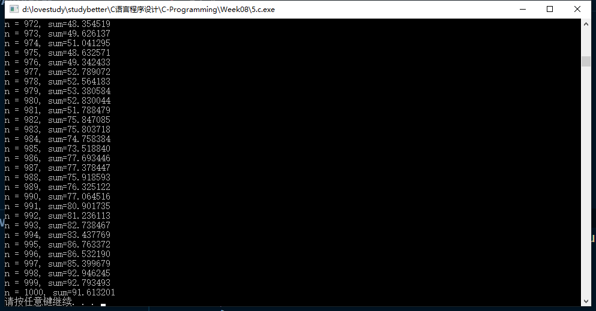

# 第八次-17377191-段秋阳

## 1. c语言程序设计现代方法（第2版） p49, 6

```c
//P49 6
#include <stdio.h>
#include <stdlib.h>
#define MAXLEN 12

int checkDigit(long long);

int main()
{
    long long ean;

    printf("Enter the first 12 digits of an EAN: ");
    scanf("%lld", &ean);
    printf("EAN = %lld\n", ean);
    printf("Check Digit: %d\n", checkDigit(ean));

    system("pause");
    return 0;
}

int checkDigit(long long ean)
{
    int input[MAXLEN];
    int sum1 = 0, sum2 = 0;

    for (int n = 0; n < MAXLEN; n++)
    {
        if (ean > 0)
        {
            int r = ean % 10;
            //printf("%d", r);
            input[n] = r;
            ean /= 10;
        }
    }

    for (int i = 1; i <= MAXLEN - 1; i += 2)
    {
        // printf("%d", input[i]);
        sum2 += input[i];
    }

    // printf("\n");

    for (int j = 0; j <= MAXLEN - 2; j += 2)
    {
        // printf("%d", input[j]);
        sum1 += input[j];
    }

    printf("\n");
    // printf("sum1=%d, sum2=%d\n", sum1, sum2);

    int check = 9 - (3 * sum1 + sum2 - 1) % 10;

    return check;
}
```


## 2. c语言程序设计现代方法（第2版） p68, 11

```c
//P68 11
#include <stdio.h>
#include <stdlib.h>
#include <string.h>

void transDigit(int);
char trans[50];

int main(void)
{
    int digit1, digit2;

    while (1)
    {
        printf("Enter a two-digit number: ");
        scanf("%1d%1d", &digit1, &digit2);

        switch (digit1)
        {
        case 1:
        {
            switch (digit2)
            {
            case 0:
            {
                strcpy(trans, "ten");
                break;
            }
            case 1:
            {
                strcpy(trans, "eleven");
                break;
            }
            case 2:
            {
                strcpy(trans, "twelve");
                break;
            }
            case 3:
            {
                strcpy(trans, "thirteen");
                break;
            }
            case 4:
            {
                strcpy(trans, "fourteen");
                break;
            }
            case 5:
            {
                strcpy(trans, "fifteen");
                break;
            }
            case 6:
            {
                strcpy(trans, "sixteen");
                break;
            }
            case 7:
            {
                strcpy(trans, "seventeen");
                break;
            }
            case 8:
            {
                strcpy(trans, "eighteen");
            }
            case 9:
            {
                strcpy(trans, "nineteen");
                break;
            }
            default:
                break;
            }
            break;
        }
        case 2:
        {
            strcpy(trans, "twenty");
            transDigit(digit2);
            break;
        }
        case 3:
        {
            strcpy(trans, "thirty");
            transDigit(digit2);
            break;
        }
        case 4:
        {
            strcpy(trans, "forty");
            transDigit(digit2);
            break;
        }
        case 5:
        {
            strcpy(trans, "fifty");
            transDigit(digit2);
            break;
        }
        case 6:
        {
            strcpy(trans, "sixty");
            transDigit(digit2);
            break;
        }
        case 7:
        {
            strcpy(trans, "seventy");
            transDigit(digit2);
            break;
        }
        case 8:
        {
            strcpy(trans, "eighty");
            transDigit(digit2);
            break;
        }
        case 9:
        {
            strcpy(trans, "ninety");
            transDigit(digit2);
            break;
        }
        default:
            break;
        }

        printf("You entered the number %s\n", trans);
    }

    system("pause");
    return 0;
}

void transDigit(int digit)
{
    switch (digit)
    {
    case 0:
        break;
    case 1:
    {
        strcat(trans, "-one");
        break;
    }
    case 2:
    {
        strcat(trans, "-two");
        break;
    }
    case 3:
    {
        strcat(trans, "-three");
        break;
    }
    case 4:
    {
        strcat(trans, "-four");
        break;
    }
    case 5:
    {
        strcat(trans, "-five");
        break;
    }
    case 6:
    {
        strcat(trans, "-six");
    }
    case 7:
    {
        strcat(trans, "-seven");
        break;
    }
    case 8:
    {
        strcat(trans, "-eight");
        break;
    }
    case 9:
    {
        strcat(trans, "-nine");
    }
    default:
        break;
    }
}
```


## 3. 40块钱买苹果，梨和西瓜，3种水果都要，总数为100kg。已知苹果价格是4元/kg, 梨0.4元/kg，西瓜0.2元/kg，问题每种水果买多少？请打印出所有作案，假设购买最小单位是kg。（该题目不太严谨，40块钱可以不花完）

```c
//Purchase fruits
#include <stdio.h>
#include <stdlib.h>

void purchase(double applePrice, double pearPrice, double watermelonPrice, double totalMoney, int total);

int main(void)
{
    purchase(4.0, 0.4, 0.2, 40.0, 100);
    system("pause");
    return 0;
}

void purchase(double ap, double pp, double wp, double money, int total)
{
    // int a = 0, p = 0, w = 0; //the amount of apple,pear,watermelon

    for (int a = 0; a <= money / ap; a++)
    {
        double cost_a = a * ap;
        for (int p = 0; p <= (money - cost_a) / pp; p++)
        {
            double cost_p = p * pp;
            for (int w = 0; w <= (money - cost_a - cost_p) / wp; w++)
            {
                if (a + p + w == total)
                    printf("Apple %d kg, pear %d kg, watermelon %d kg\n", a, p, w);
            }
        }
    }
}
```


## 4. 已知xyz+yzz=532，其中x,y,x都是数字。编程求出x,y,z各是多少。（x不能是0，y也不能是0）

```c
//Solve the equation: xyz+yzz=532
#include <stdio.h>
#include <stdlib.h>

void solve(void);

int main(void)
{
    solve();
    system("pause");
    return 0;
}

void solve(void)
{
    for (int x = 0; x < 10; x++)
    {
        for (int y = 0; y < 10; y++)
        {
            for (int z = 0; z < 10; z++)
            {
                if (100 * x + 110 * y + 12 * z == 532)
                    printf("x = %d, y=%d, z=%d\n", x, y, z);
            }
        }
    }
}
```


## 5.求表达式1-1/2+2/3-3/5+5/8-8/13+13/21-…前n项的和。(最早版本有误，已更新）

```c
//calculate a series
#include <stdio.h>
#include <stdlib.h>
#include <math.h>

double seriesSum(int num);
int fibonacci(int num);

int main()
{
    for (int n = 1; n <= 1000; n++)
        printf("n = %d, sum=%lf\n", n, seriesSum(n));

    system("pause");
    return 0;
}

int fibonacci(int n)
{
    if (n == 1 || n == 2)
        return 1;
    else
    //return fibonacci(n - 1) + fibonacci(n - 2);
    {
        int a = 0, b = 1;
        for (int i = 1; i <= n; i++)
        {
            int temp1 = a;
            int temp2 = b;
            a = temp2;
            b = temp1 + temp2;
        }
        return a;
    }
}

double seriesSum(int n)
{
    double sum = 0;
    for (int i = 1; i <= n; i++)
        sum += pow(-1, i + 1) * fibonacci(i) / fibonacci(i + 1);

    return sum;
}
```



## 6.输入两个分数的加和形式，求和并返回化简的结果。如输入5/6+3/4，返回19/12。提示：注入读入的格式；注意化简。

```c
//Add two fractions
#include <stdio.h>
#include <stdlib.h>

int maxPrime(int, int);
// int fractionAdd(int numerator1, int denominator1, int numerator2, int denominator2);

int main()
{
    int n1, d1, n2, d2, n3, d3;
    printf("Plz enter an add formula:\n");
    scanf("%d/%d+%d/%d", &n1, &d1, &n2, &d2);

    if (d1 == 0 || d2 == 0)
    {
        printf("Input error!\n");
        return -1;
    }
    else
    {
        n3 = n1 * d2 + n2 * d1;
        d3 = d1 * d2;
        int prime = maxPrime(n3, d3);
        n3 /= prime;
        d3 /= prime;
    }

    if (d3 == 1)
        printf("%d\n", n3);
    else
        printf("%d/%d\n", n3, d3);

    system("pause");
    return 0;
}

int maxPrime(int m, int n)
{
    int i;
    i = (m < n) ? m : n;

    while (i > 0)
    {
        if (m % i == 0 && n % i == 0)
            return i;
        i--;
    }
}
```


## 7.一堆桃子，猴子第一天吃了总数的一半，又吃了一个（因为感觉很好吃），以后每天都如此。第n天想吃时，发现只有一个桃子。求最初的桃子。提示：倒推，n： 1；n-1： (1+1)*2

```c
//How many are the peaches?
#include <stdio.h>
#include <stdlib.h>

int eatPeach(int n);

int main()
{
    int n = 10;
    printf("n = %d, total: %d\n", n, eatPeach(n));
    system("pause");
    return 0;
}

int eatPeach(int n)
{
    int peach = 1;

    for (n; n >= 1; n--)
    {
        peach = (peach + 1) * 2;
    }

    return peach;
}
```

