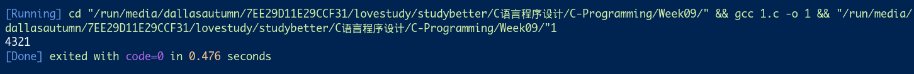
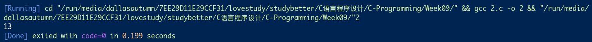
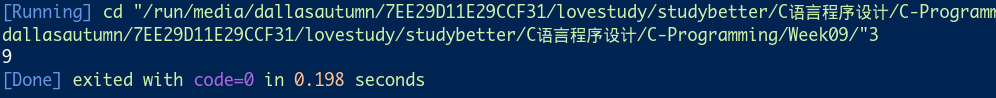
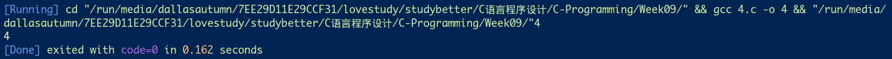
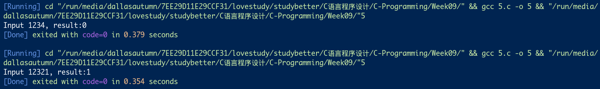
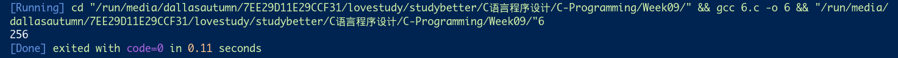

# 第九次-17377191-段秋阳

## 1. 尝试用递归倒序输出一个正整数
```c
#include <stdio.h>
#include <stdlib.h>

int recursiveReverse(int);

int main()
{
    recursiveReverse(1234);
    return 0;
}

int recursiveReverse(int num)
{
    if (num > 0)
    {
        printf("%d", num % 10);
        recursiveReverse(num / 10);
    }
}
```


## 2. P285，1（尝试比较一下循环和递归的效率）
```c
//Fibonacci P285:1
#include <stdio.h>

int fib(int num);

int main()
{
    printf("%d", fib(8));
    return 0;
}

int fib(int n)
{
    if (n == 1)
        return 0;
    else if (n == 2)
        return 1;
    else
        return fib(n - 1) + fib(n - 2);
}
```


## 3. P285，3
```c
//P285:3
#include <stdio.h>

int arithmeticSequence(int firstItem, int commonDifference, int itemIndex);

int main()
{
    printf("%d", arithmeticSequence(0, 1, 10));
    return 0;
}

int arithmeticSequence(int a, int d, int n)
{
    if (n == 1)
        return a;
    else
        return d + arithmeticSequence(a, d, n - 1);
}
```


## 4. P286，6
```c
//P286:6
#include <stdio.h>

int gcd(int num1, int num2);
int max(int num1, int num2);
int min(int num1, int num2);

int main()
{
    printf("%d", gcd(320, 116));
    return 0;
}

int gcd(int a, int b)
{
    if (a % b == 0)
        return b;
    else
        return gcd(b, a % b);
}
```


5. P286，7(题目表述奇怪，本意就是实现两个函数，一个递归，一个循环，来进行回文数字的判读)
```c
//P286:7
#include <stdio.h>
#include <stdlib.h>
#include <string.h>
#define M 20

int numpal(int n);
int getDigit(int n, int i);

int main()
{
    int num;
    for (int i = 0; i < 5; i++)
    {
        printf("Plz enter a number:\n");
        scanf("%d", &num);
        printf("Input %d, result:%d\n", num, numpal(num));
    }
    return 0;
}

int numpal(int n)
{
    char str[M];
    sprintf(str, "%d", n);
    int len = strlen(str);

    for (int i = 1; i <= len / 2; i++)
        if (getDigit(n, i) == getDigit(n, len + i - 1))
            return 1;
    return 0;
}

int getDigit(int n, int i)
{
    if (i == 1)
        return n % 10;
    else
        return getDigit(n / 10, i - 1);
}
```


6. 《现代方法》(第2版）p153, 7
```c
//《现代方法》P153：7
#include <stdio.h>
#include <stdlib.h>

int power(int x, int n);

int main()
{
    printf("%d", power(2, 9));
    return 0;
}

int power(int x, int n)
{
    if (n == 0)
        return 1;
    else if (n % 2 == 0)
        return power(x, n / 2) * power(x, n / 2);
    else
        return x * power(x, n - 1);
}
```
