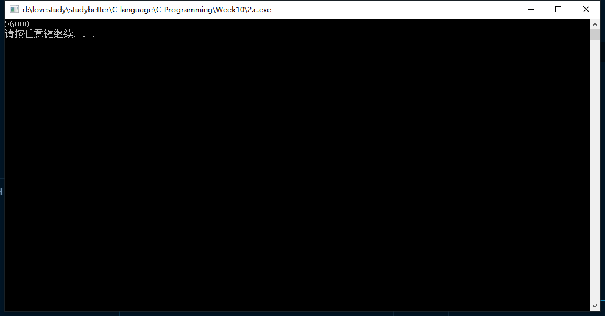
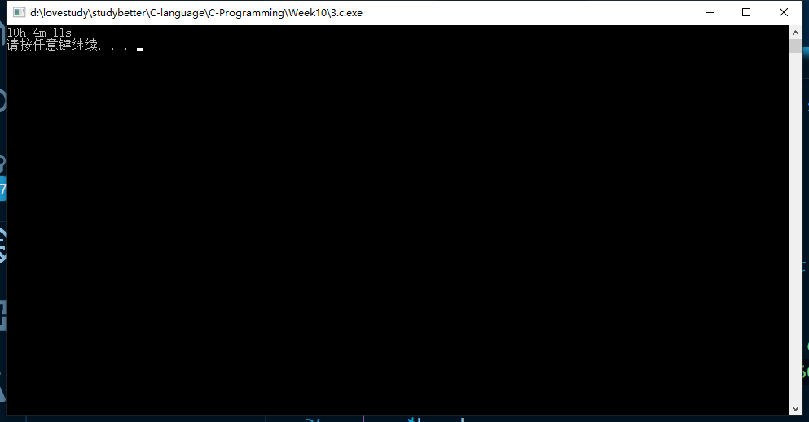
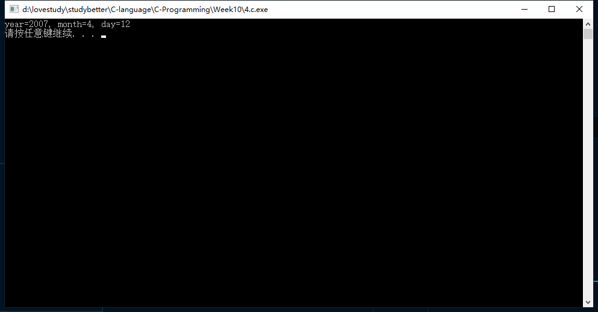
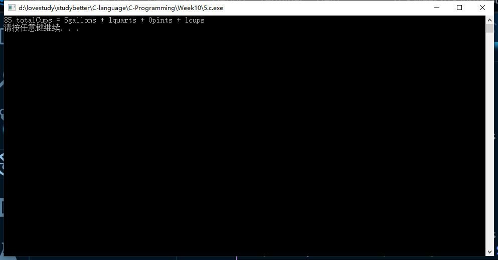
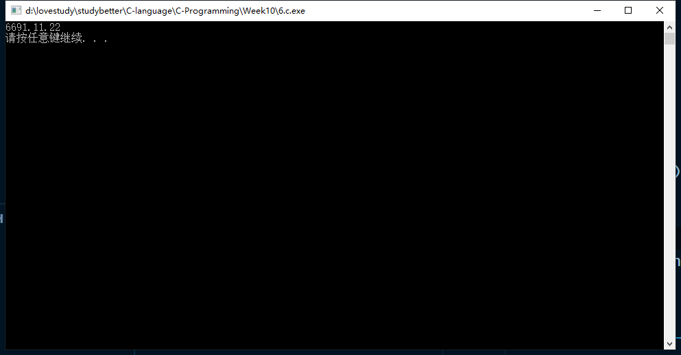
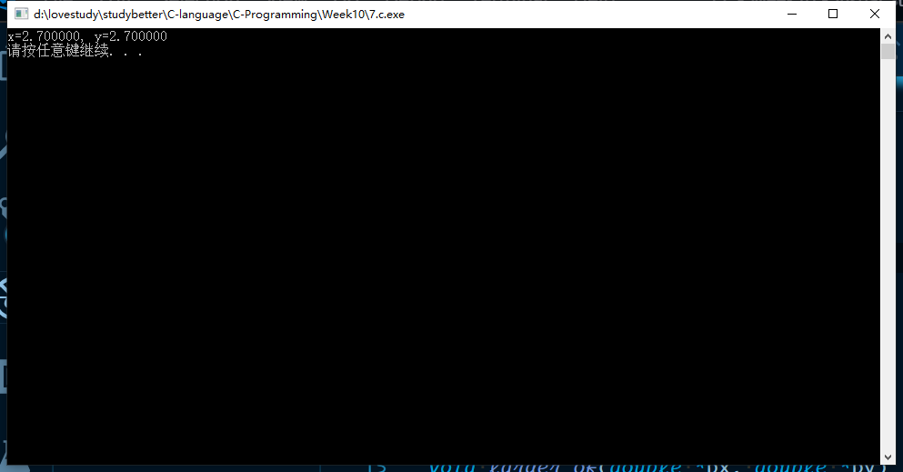

# 第十次-17377191-段秋阳

## 1. P273 简答题 第2题

```c
//P273 2
//&temp=16892,&dist=16896,&date=16900,&miles=16908
```

## 2. P275, 3

```c
//P275 3
#include <stdio.h>
#include <stdlib.h>
#include <string.h>
#define M 20

int secsa(char[]);

int main()
{
    char buff[100];
    strcpy(buff, "10h0m0s");
    printf("%d\n", secsa(buff));

    system("pause");
    return 0;
}

int secsa(char time[])
{

    char hour[M], min[M], sec[M];
    //time is as the format of "00h00m00s"
    char seps[] = "hms";
    strcpy(hour, strtok(time, seps));
    strcpy(min, strtok(NULL, seps));
    strcpy(sec, strtok(NULL, seps));

    int h = atoi(hour);
    int m = atoi(min);
    int s = atoi(sec);

    return 3600 * h + 60 * m + s;
}

void secsb(char time[], int *p)
{
    //int *p = &totSec
    char hour[M], min[M], sec[M];
    //time is as the format of "00h00m00s"
    char seps[] = "hms";
    strcpy(hour, strtok(time, seps));
    strcpy(min, strtok(NULL, seps));
    strcpy(sec, strtok(NULL, seps));

    int h = atoi(hour);
    int m = atoi(min);
    int s = atoi(sec);

    *p = 3600 * h + 60 * m + s;
}
```



**I hate the exception of *Segmentation Fault* FOREVER!!!!!**

## 3. P275, 4

```c
//P275 4
#include <stdio.h>
#include <stdlib.h>

void time(int totSec, int *h, int *m, int *s);

int main()
{
    int hours, mins, secs;
    int *h = &hours, *m = &mins, *s = &secs;
    time(36251, h, m, s);
    printf("%dh %dm %ds\n", hours, mins, secs);

    system("pause");
    return 0;
}

void time(int totSec, int *h, int *m, int *s)
{
    int hours = totSec / 3600;
    int mins = (totSec - 3600 * hours) / 60;
    int secs = (totSec - 3600 * hours - 60 * mins);

    *h = hours;
    *m = mins;
    *s = secs;
}
```



## 4. P275, 6

```c
//P275 6
#include <stdio.h>
#include <stdlib.h>

void date(long dateInt, int *year, int *month, int *day);

int main()
{
    int year, month, day;
    date(20070412, &year, &month, &day);
    printf("year=%d, month=%d, day=%d\n", year, month, day);
    system("pause");
    return 0;
}

void date(long dateInt, int *y, int *m, int *d)
{
    int year = dateInt / 10000;
    int month = (dateInt - 10000 * year) / 100;
    int day = dateInt - 10000 * year - 100 * month;

    *y = year;
    *m = month;
    *d = day;
}
```



## 5. P281, 2

```c
//P281 2
#include <stdio.h>
#include <stdlib.h>

void liquid(int totalCups, int *gallons, int *quarts, int *pints, int *cups);

int main()
{
    int gallons, quarts, pints, cups;
    int totalCups = 85;
    liquid(totalCups, &gallons, &quarts, &pints, &cups);
    printf("%d totalCups = %dgallons + %dquarts + %dpints + %dcups\n", totalCups, gallons, quarts, pints, cups);
    system("pause");
    return 0;
}

void liquid(int totalCups, int *g, int *q, int *p, int *c)
{
    int gallons = totalCups / 16;
    int quarts = (totalCups - 16 * gallons) / 4;
    int pints = (totalCups - 16 * gallons - 4 * quarts) / 2;
    int cups = totalCups - 16 * gallons - 4 * quarts - 2 * pints;

    *g = gallons;
    *q = quarts;
    *p = pints;
    *c = cups;
}
```



## 6. P281, 5

```c
//P281 5
#include <stdio.h>
#include <stdlib.h>

void yrCalc(long, int *, int *, int *);

int main()
{
    int totalDays = 1725081;
    int year, month, day;
    yrCalc(totalDays, &year, &month, &day);
    printf("%d.%d.%d\n", year, month, day);
    system("pause");
    return 0;
}

void yrCalc(long totalDays, int *y, int *m, int *d)
{
    int years = totalDays / 360;
    int months = (totalDays - 360 * years) / 30;
    int days = totalDays - 360 * years - 30 * months;

    *y = 1900 + years;
    *m = 1 + months;
    *d = 1 + days;
}
```



## 7. 编写并测试一个函数larger_of，该函数把两个double类型变量的值替换为较大的值 。如x>y时，y将被修改为x。

```c
#include <stdio.h>
#include <stdlib.h>

void larger_of(double *, double *);

int main()
{
    double x = 1.5, y = 2.7;
    larger_of(&x, &y);
    printf("x=%lf, y=%lf\n", x, y);
    system("pause");
    return 0;
}

void larger_of(double *px, double *py)
{
    if (*px < *py)
        *px = *py;
    else
        *py = *px;
}
```



Pointers can be powerful and convenient, but if you aren't a skillful and seasoned programmer:

**Never try to get in touch with the memory!!!**