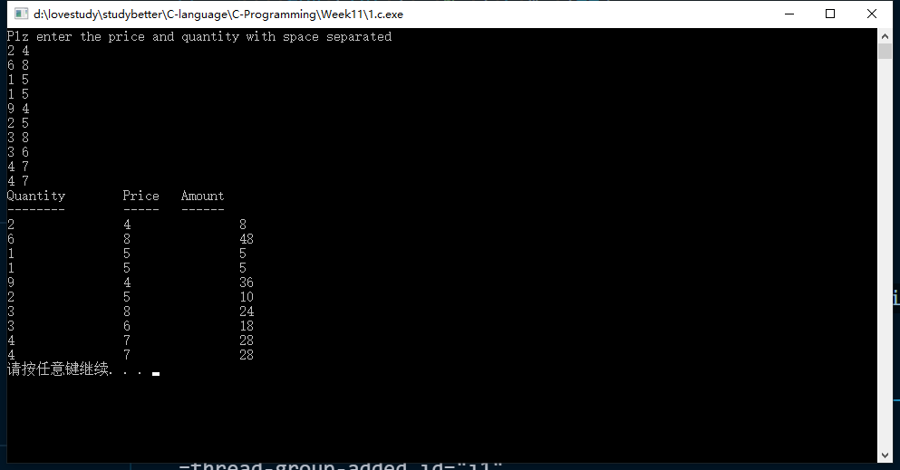
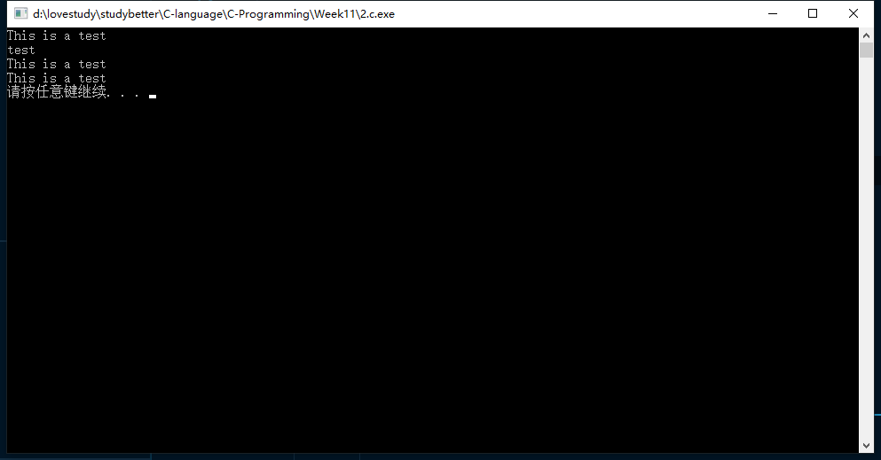
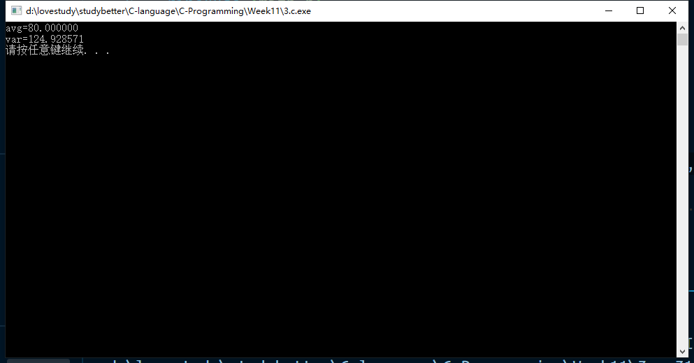
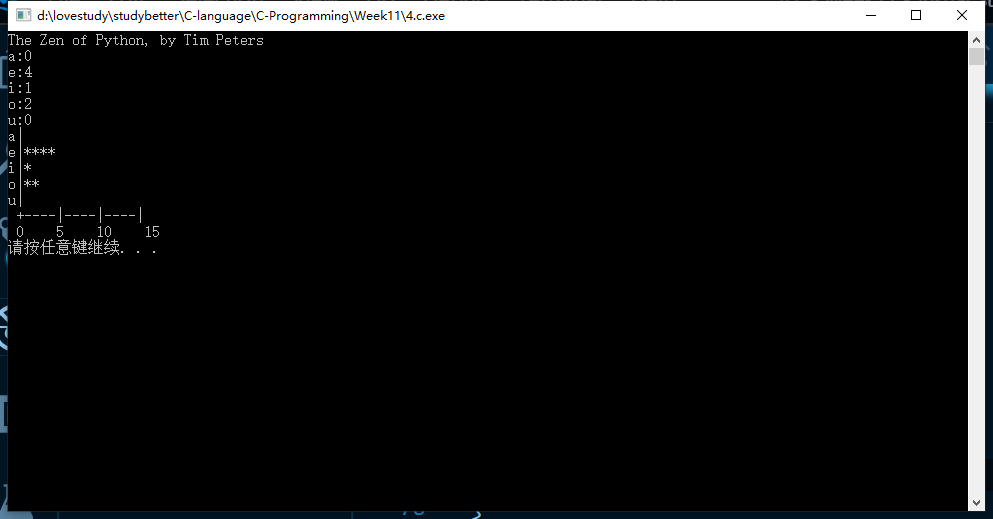
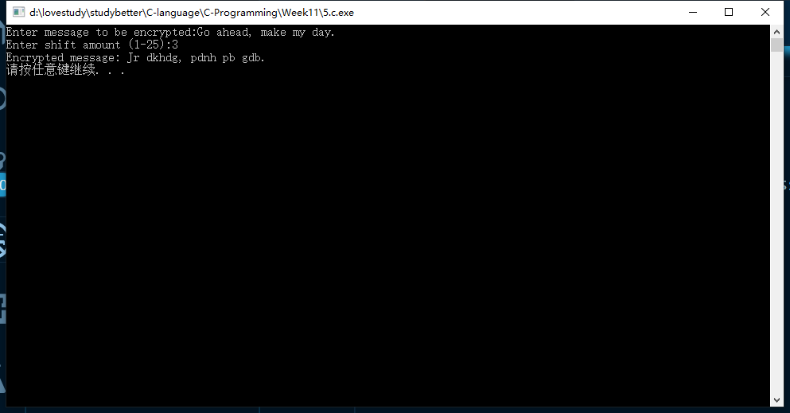
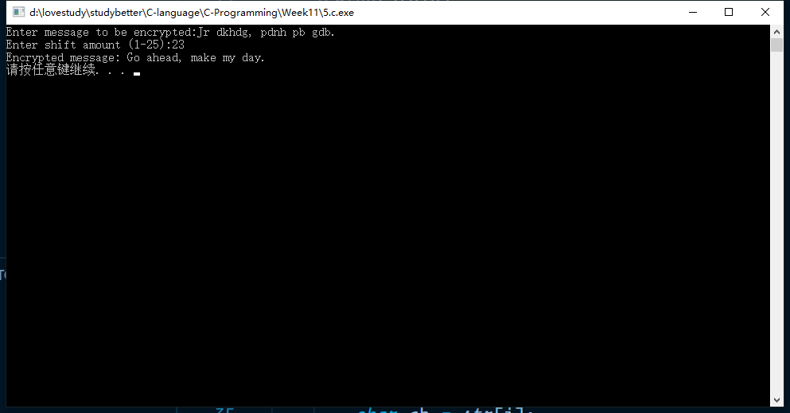
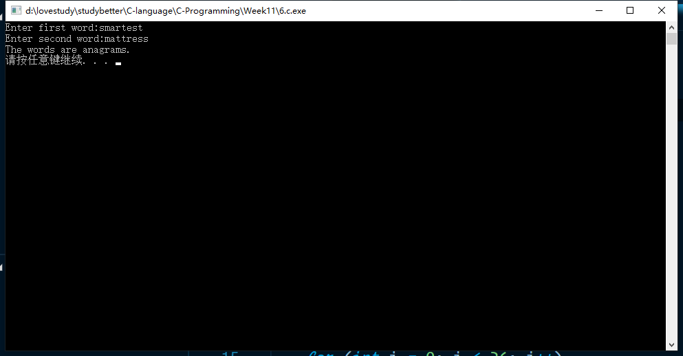
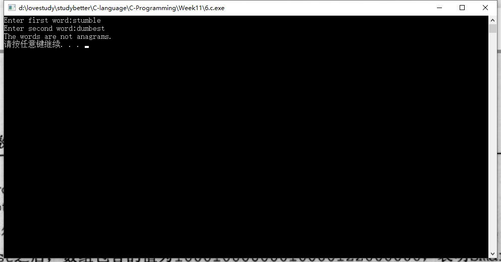
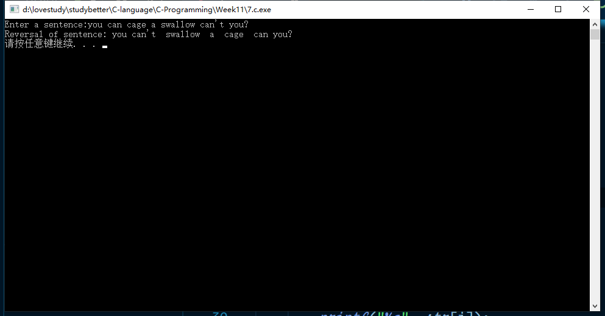
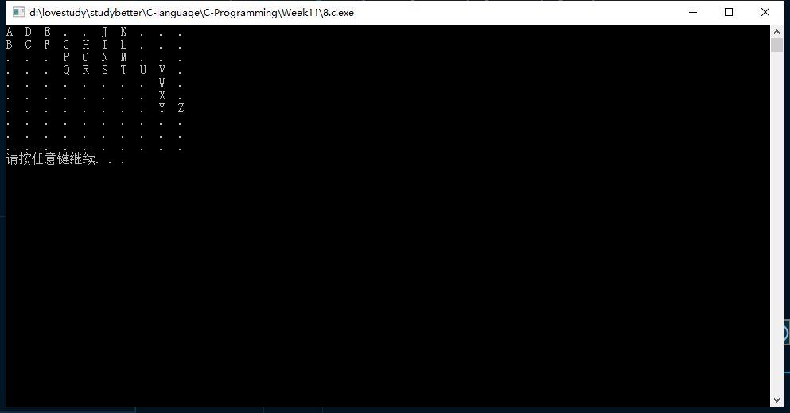

# 第11次-段秋阳-17377191

## 1, P298第4题

```c
//P298 4
#include <stdio.h>
#include <stdlib.h>
#define N 10

int main()
{
    int price[N], quantity[N], amount[N];

    printf("Plz enter the price and quantity with space separated\n");
    for (int i = 0; i < N; i++)
    {
        rewind(stdin);
        scanf("%d %d", &price[i], &quantity[i]);
        amount[i] = price[i] * quantity[i];
    }

    printf("Quantity\tPrice\tAmount\n");
    printf("--------\t-----\t------\n");
    for (int i = 0; i < N; i++)
        printf("%d\t\t%d\t\t%d\n", price[i], quantity[i], amount[i]);

    system("pause");
    return 0;
}
```



## 2, P302第2题

```c
//P302 2
#include <stdio.h>
#include <stdlib.h>

int main()
{
    int i = 0, j = 0;
    char strtest[] = "This is a test";

    for (i = 0; i <= 14; i++)
        printf("%c", strtest[i]);

    printf("\n");

    for (i = 10; i < 14; i++)
        printf("%c", strtest[i]);

    printf("\n");

    printf("%s\n", strtest);

    while (strtest[j] != '\0')
    {
        printf("%c", strtest[j]);
        j++;
    }
    printf("\n");

    system("pause");
    return 0;
}
```



## 3, P306第5题 (将数组作为参数)

```c
//P306 5
#include <stdio.h>
#include <stdlib.h>
#include <math.h>

double calcAvg(int array[], int arrLen);
double variance(int array[], int arrLen);

int main()
{
    int testVals[] = {89, 95, 72, 83, 99, 54, 86, 75, 92, 73, 79, 75, 82, 73};
    int len = sizeof(testVals) / sizeof(testVals[0]);
    printf("avg=%lf\nvar=%lf\n", calcAvg(testVals, len), variance(testVals, len));
    system("pause");
    return 0;
}

double calcAvg(int array[], int len)
{
    int sum = 0;
    for (int i = 0; i < len; i++)
        sum += array[i];
    double avg = sum / len;
    return avg;
}

double variance(int array[], int len)
{
    double avg = calcAvg(array, len);
    double SST = 0;
    int arrLen = sizeof(array) / sizeof(array[0]);
    for (int i = 0; i < len; i++)
        SST += pow((array[i] - avg), 2);
    double var = SST / len;
    return var;
}
```



## 4, P311第10题

```c
//P311 10
#include <stdio.h>
#include <stdlib.h>
#include <string.h>
#define M 100

void printVowel(int, int, int, int, int);
void printStar(int);

int main()
{
    int acount = 0, ecount = 0, icount = 0, ocount = 0, ucount = 0;
    char str[M];
    gets(str);
    for (int i = 0; i < strlen(str); i++)
    {
        switch (str[i])
        {
        case 'a':
        {
            acount++;
            break;
        }
        case 'e':
        {
            ecount++;
            break;
        }
        case 'i':
        {
            icount++;
            break;
        }
        case 'o':
        {
            ocount++;
            break;
        }
        case 'u':
        {
            ucount++;
            break;
        }
        default:
            break;
        }
    }
    printf("a:%d\ne:%d\ni:%d\no:%d\nu:%d\n", acount, ecount, icount, ocount, ucount);
    printVowel(acount, ecount, icount, ocount, ucount);
    system("pause");
    return 0;
}

void printVowel(int acount, int ecount, int icount, int ocount, int ucount)
{
    printf("a|");
    printStar(acount);
    printf("\n");

    printf("e|");
    printStar(ecount);
    printf("\n");

    printf("i|");
    printStar(icount);
    printf("\n");

    printf("o|");
    printStar(ocount);
    printf("\n");

    printf("u|");
    printStar(ucount);
    printf("\n");

    printf(" +----|----|----|\n");
    printf(" 0    5    10    15\n");
}

void printStar(int count)
{
    for (int i = 0; i < count; i++)
        printf("*");
}
```



## 5, 《现代方法第2版》p127, 15(加密和解密均要实现)

```c
//《现代方法》P127 15
#include <stdio.h>
#include <stdlib.h>
#include <string.h>
#define MAXLEN 80

void encrypt(char message[], int shiftAmount);

int main()
{
    char message[MAXLEN];
    int shiftAmount;

    printf("Enter message to be encrypted:");
    rewind(stdin);
    gets(message);

    printf("Enter shift amount (1-25):");
    rewind(stdin);
    scanf("%d", &shiftAmount);

    encrypt(message, shiftAmount);
    printf("Encrypted message: %s\n", message);

    system("pause");
    return 0;
}

void encrypt(char str[], int n)
{
    int len = strlen(str);

    for (int i = 0; i < len; i++)
    {
        char ch = str[i];
        if (ch >= 'a' && ch <= 'z')
            str[i] = ((ch - 'a') + n) % 26 + 'a';
        if (ch >= 'A' && ch <= 'Z')
            str[i] = ((ch - 'A') + n) % 26 + 'A';
    }
}
```




## 6, 《现代方法第2版》p127, 16

```c
//《现代方法》p127,16
#include <stdio.h>
#include <stdlib.h>
#include <string.h>
#include <ctype.h>
#define M 20

int zeroArray(int[], int);

int main()
{
    char word1[M], word2[M];
    int count[26];

    for (int i = 0; i < 26; i++)
        count[i] = 0;
    printf("Enter first word:");
    rewind(stdin);
    gets(word1);

    printf("Enter second word:");
    rewind(stdin);
    gets(word2);

    for (int i = 0; i < strlen(word1); i++)
    {
        if (isalpha(word1[i]))
            count[tolower(word1[i]) - 97] += 1;
    }

    for (int i = 0; i < strlen(word2); i++)
    {
        if (isalpha(word2[i]))
            count[tolower(word2[i]) - 97] -= 1;
    }

    if (zeroArray(count, 26))
        printf("The words are anagrams.\n");
    else
        printf("The words are not anagrams.\n");

    system("pause");
    return 0;
}

int zeroArray(int array[], int len)
{
    for (int i = 0; i < len; i++)
    {
        if (array[i] != 0)
            return 0; //Not all zero
    }
    return 1;
}
```




## 7. 《现代方法第2版》p127, 14(终止符号也要读入)

```c
//《现代方法》P127，14
#include <stdio.h>
#include <stdlib.h>
#include <string.h>
#define M 100

int main()
{
    char str[M];
    printf("Enter a sentence:");
    gets(str);

    int len = strlen(str);
    int s = len - 2;
    char punc = str[len - 1];
    int t;

    printf("Reversal of sentence:");
    for (int i = len - 2; i >= 0; i--)
    {
        if (str[i] == ' ')
        {
            t = i;
            for (int j = t; j <= s; j++)
                printf("%c", str[j]);
            s = t;
        }
    }
    for (int i = 0; i < s; i++)
        printf("%c", str[i]);
    printf("%c\n", punc);

    system("pause");
    return 0;
}
```



## 8. 《现代方法第2版》p126, 9 (注意死循环)

```c
//《现代方法》p126,9
#include <stdio.h>
#include <stdlib.h>
#include <time.h>
#define M 10

void move(int *i, int *j, int flag, int count, char mat[M][M]);
int check(int i, int j, int flag, char mat[M][M]);
int checkAll(int i, int j, int flag, char mat[M][M]);
void printMat(char mat[M][M]);

int main()
{
    char mat[M][M];
    int i = 0, j = 0, count = 0, flag = 0;

    for (int x = 0; x < M; x++)
        for (int y = 0; y < M; y++)
            mat[x][y] = '.';
    mat[0][0] = 'A';

    do
    {
        do
        {
            flag = rand() % 4;
        } while (!check(i, j, flag, mat));

        count++;
        move(&i, &j, flag, count, mat);
    } while (checkAll(i, j, flag, mat) && count < 25);

    printMat(mat);
    system("pause");
    return 0;
}

void move(int *i, int *j, int flag, int count, char mat[M][M])
{
    switch (flag)
    {
    case 0:
    {
        *i = *i - 1;
        mat[*i][*j] = 'A' + count;
        break;
    }
    case 1:
    {
        *i = *i + 1;
        mat[*i][*j] = 'A' + count;
        break;
    }
    case 2:
    {
        *j = *j - 1;
        mat[*i][*j] = 'A' + count;
        break;
    }
    case 3:
    {
        *j = *j + 1;
        mat[*i][*j] = 'A' + count;
        break;
    }
    default:
        break;
    }
}

int check(int i, int j, int flag, char mat[M][M])
{
    switch (flag)
    {
    case 0:
    {
        if (i - 1 >= 0 && mat[i - 1][j] == '.')
            return 1;
        else
            return 0;
    }
    case 1:
    {
        if (i + 1 <= M && mat[i + 1][j] == '.')
            return 1;
        else
            return 0;
    }
    case 2:
    {
        if (j - 1 >= 0 && mat[i][j - 1] == '.')
            return 1;
        else
            return 0;
    }
    case 3:
    {
        if (j + 1 <= M && mat[i][j + 1] == '.')
            return 1;
        else
            return 0;
    }
    default:
        return 0;
    }
}

int checkAll(int i, int j, int flag, char mat[M][M])
{
    for (int flag = 0; flag < 4; flag++)
    {
        if (check(i, j, flag, mat) != 0)
            return 1;
    }

    return 0;
}

void printMat(char mat[M][M])
{
    for (int i = 0; i < M; i++)
    {
        for (int j = 0; j < M; j++)
        {
            printf("%c  ", mat[i][j]);
        }
        printf("\n");
    }
}
```



Never spend such long time on Clang homework, too hard....