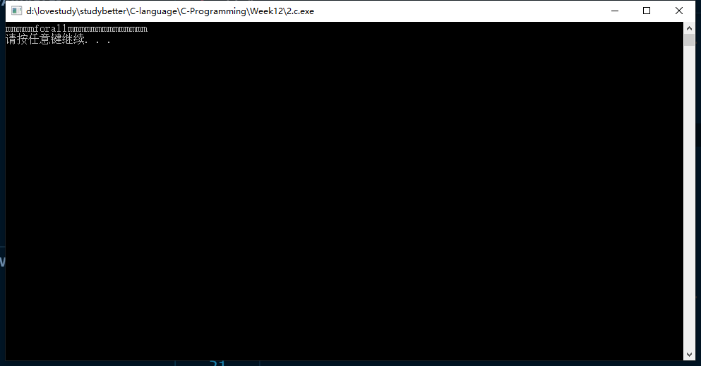

# 第12周-17377191-段秋阳

## 1, P351第4题

```c
//P351 4
#include <stdio.h>
#include <stdlib.h>
#include <string.h>
#define M 100

int main()
{
    char str[M];
    gets(str);

    for (int i = 0; i < strlen(str); i++)
        printf("%x\n", str[i]);

    system("pause");
    return 0;
}
```


## 2, P351第8题

```c
//P351 8
#include <stdio.h>
#include <stdlib.h>
#include <string.h>
#define M 100

void addChar(const char str[], char src[], int start);

int main()
{
    char message[M] = "mmmmmmmmmmmmmmmmmmm";
    addChar("forall", message, 6);
    puts(message);
    system("pause");
    return 0;
}

void addChar(const char str[], char src[], int start)
{
    int len = strlen(str);

    for (int j = strlen(src) - 1; j >= start - 1; j--)
        src[j + len] = src[j];

    for (int i = 0; i < len; i++)
        src[start - 1 + i] = str[i];
}
```



## 3, P372第6题

```c
//P372 6
#include <stdio.h>
#include <stdlib.h>
#include <string.h>

int main()
{
    char c;
    int count = 0;
    while ((c = getchar()) != EOF)
        if (c == '.' || c == '!' || c == '?')
            count++;

    printf("sentence count = %d\n", count);

    system("pause");
    return 0;
}
```


## 4, 《现代方法第2版》, P221, 12

```c
//《现代方法》P221,12
#include <stdio.h>
#include <stdlib.h>
#include <string.h>
#define M 20

void get_extension(const char *file_name, char *extension);

int main()
{
    // char file_name[M];
    char extension[M];
    // strcpy(file_name, "demo.txt");
    get_extension("demo.txt", extension);
    printf("%s\n", extension);

    system("pause");
    return 0;
}

void get_extension(const char *file_name, char *extension)
{
    int len = strlen(file_name);
    int i = 0, j = 0;

    while (file_name[i] != '.')
        i++;
    i++;

    for (i; i < len; i++)
        extension[j++] = file_name[i];
}
```


## 5, 《现代方法第2版》, P221, 13

```c
//《现代方法》P221,13
#include <stdio.h>
#include <stdlib.h>
#include <string.h>
#define M 100

void build_index_url(const char *domain, char *index_url);

int main()
{
    char index_url[M];
    build_index_url("knking.com", index_url);
    printf("%s\n", index_url);
    system("pause");
    return 0;
}

void build_index_url(const char *domain, char *index_url)
{
    strcpy(index_url, "http://www.");
    strcat(index_url, domain);
    strcat(index_url, "/index.html");
}
```


##6, 《现代方法第2版》, P222, 1

```c
//《现代方法》P222,1
#include <stdio.h>
#include <stdlib.h>
#include <string.h>
#define M 20

int main()
{
    char smallest_word[M] = "z", largest_word[M] = "\0", word[M];
    do
    {
        printf("Enter word:  ");
        rewind(stdin);
        gets(word);
        if (strcmp(word, smallest_word) < 0)
            strcpy(smallest_word, word);
        if (strcmp(largest_word, word) < 0)
            strcpy(largest_word, word);
    } while (strlen(word) != 4);

    printf("Smallest word: %s\n", smallest_word);
    printf("Largest word: %s\n", largest_word);
    system("pause");
    return 0;
}
```


## 7, 《现代方法第2版》, P223, 4

```c
//《现代方法》p223,4
#include <stdio.h>
#include <stdlib.h>

int main(int argc, char *argv[])
{
    for (int i = argc - 1; i >= 1; i--)
        printf("%s ", argv[i]);

    system("pause");
    return 0;
}
```


