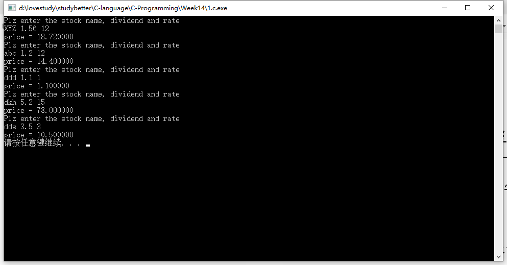
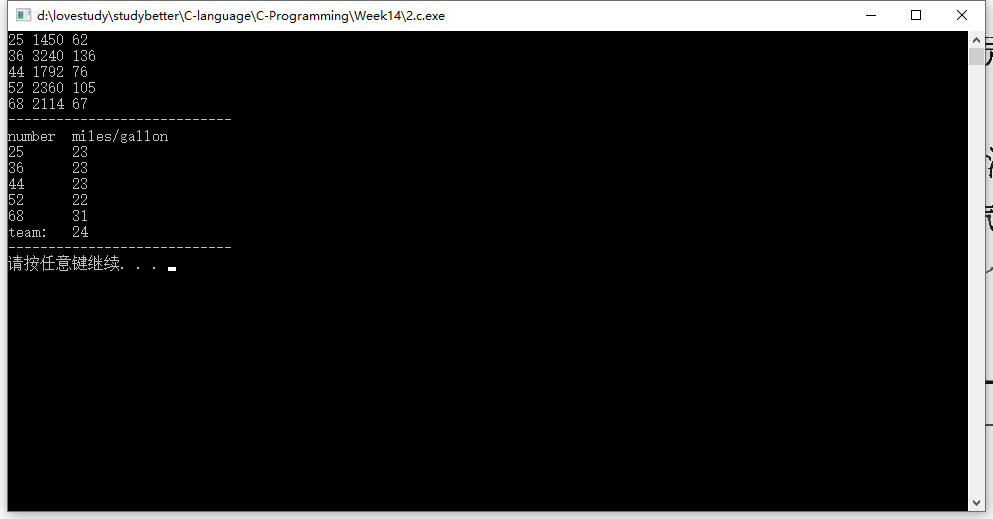
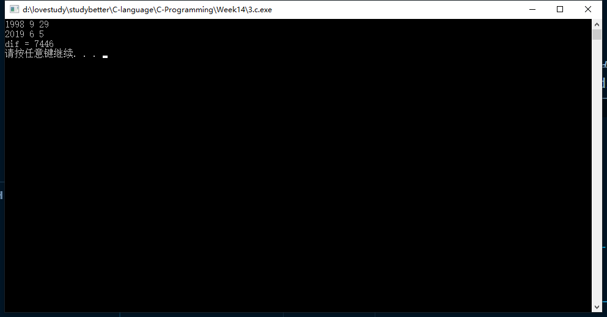
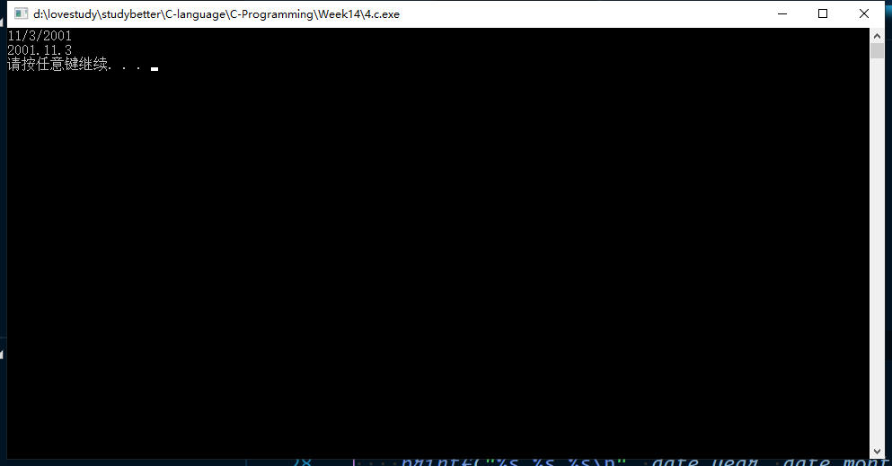
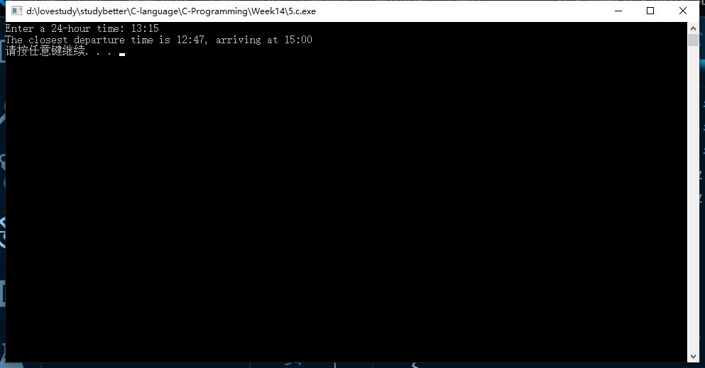

# 第14周-17377191-段秋阳

## 1. P452，第2题
```c
//P452 2
#include <stdio.h>
#include <stdlib.h>

typedef struct
{
    char name[20];
    double div;
    double rate;
} Stock;

int main()
{
    for (int i = 0; i < 5; i++)
    {
        Stock stock;
        printf("Plz enter the stock name, dividend and rate\n");
        scanf("%s %lf %lf", &stock.name, &stock.div, &stock.rate);
        printf("price = %lf\n", stock.div * stock.rate);
    }

    system("pause");
    return 0;
}
```


## 2. P456，第4题
```c
//P456,4
#include <stdio.h>
#include <stdlib.h>

typedef struct
{
    int number;
    int miles;
    int gallons;
} carLog;

int main()
{
    int totalMiles = 0, totalGals = 0;
    carLog logs[5];

    for (int i = 0; i < 5; i++)
    {
        scanf("%d %d %d", &logs[i].number, &logs[i].miles, &logs[i].gallons);
        totalMiles += logs[i].miles;
        totalGals += logs[i].gallons;
    }

    printf("----------------------------\n");
    printf("number  miles/gallon\n");
    for (int i = 0; i < 5; i++)
        printf("%d\t%d\n", logs[i].number, logs[i].miles / logs[i].gallons);
    printf("team:\t%d\n", totalMiles / totalGals);
    printf("----------------------------\n");

    system("pause");
    return 0;
}
```



## 3. P462，第2题
```c
//P462 2
#include <stdio.h>
#include <stdlib.h>

struct Date
{
    int month;
    int day;
    int year;
};

int days(Date);
int difDays(Date, Date);

int main()
{
    struct Date date1, date2;
    scanf("%d %d %d", &date1.year, &date1.month, &date1.day);
    scanf("%d %d %d", &date2.year, &date2.month, &date2.day);
    printf("dif = %d\n", difDays(date1, date2));
    system("pause");
    return 0;
}

int days(struct Date date)
{
    return (date.year - 1900) * 360 + (date.month - 1) * 30 + (date.day - 1);
}

int difDays(struct Date date1, struct Date date2)
{
    return days(date2) - days(date1);
}
```



## 4. P462，第4题
```c
//P462 4
#include <stdio.h>
#include <stdlib.h>
#include <string.h>
#define M 20

typedef struct
{
    char *month;
    char *day;
    char *year;
} Date;

char *larger(char *, char *);

int main()
{
    Date date;
    char date1[M], date2[M];
    strcpy(date1, "10/9/2001");
    strcpy(date2, "11/3/2001");
    char *ret = larger(date1, date2);
    printf("%s\n", ret);
    const char sep[2] = "/";
    date.month = strtok(ret, sep);
    date.day = strtok(NULL, sep);
    date.year = strtok(NULL, sep);
    printf("%s.%s.%s\n", date.year, date.month, date.day);
    system("pause");
    return 0;
}

char *larger(char *date1, char *date2)
{
    return (strcmp(date1, date2) > 0) ? date1 : date2;
}
```


## 5. 《现代方法（2）》P293，第5题
```c
//《现代方法》P293,5
#include <stdio.h>
#include <stdlib.h>
#include <string.h>
#include <math.h>
#define M 1
#define LEN 20

typedef struct
{
    int dep;
    int arr;
} Flight;

int main()
{
    Flight flight[8];
    int hour, min, dif = 10000, j = 0;

    flight[0].dep = 480, flight[0].arr = 616;
    flight[1].dep = 583, flight[1].arr = 712;
    flight[2].dep = 679, flight[2].arr = 811;
    flight[3].dep = 767, flight[3].arr = 900;
    flight[4].dep = 840, flight[4].arr = 968;
    flight[5].dep = 945, flight[5].arr = 1075;
    flight[6].dep = 1140, flight[6].arr = 1280;
    flight[7].dep = 1305, flight[7].arr = 1438;

    printf("Enter a 24-hour time: ");
    scanf("%d:%d", &hour, &min);

    for (int i = 0; i < 8; i++)
        if (dif > abs(60 * hour + min - flight[i].dep))
        {
            dif = abs(60 * hour + min - flight[i].dep);
            j = i;
        }
    printf("The closest departure time is %d:%02d, arriving at %d:%02d\n", flight[j].dep / 60, flight[j].dep % 60, flight[j].arr / 60, flight[j].arr % 60);
    system("pause");
    return 0;
}
```


