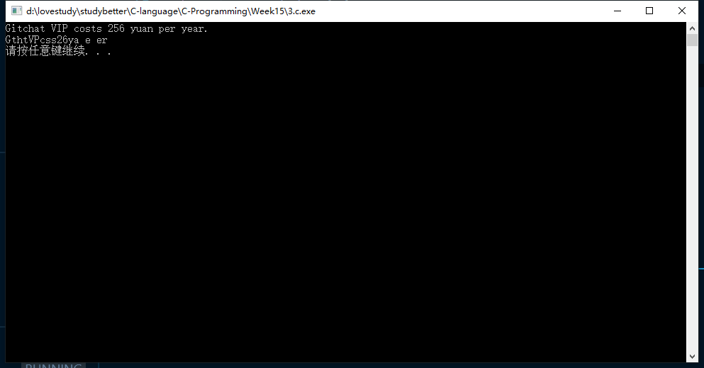

#第15周-17377191-段秋阳

## 1. P391, 5 (建议逐个字符读)
```c
//P391 5
#include <stdio.h>
#include <stdlib.h>
#include <string.h>

int main()
{
    FILE *fp = NULL;
    fp = fopen("1.txt", "r");
    char line[100];
    const char sep[] = ",";

    for (int i = 0; i < 4; i++)
    {
        fgets(line, sizeof(line), fp);
        printf("Name: %s\n", strtok(line, sep));
        printf("Address: %s\n", strtok(NULL, sep));
        printf("City, State: %s\n", strtok(NULL, "\n"));
        printf("\n");
    }

    system("pause");
    return fclose(fp);
}
```


## 2. P392, 6
```c
//P392,6
#include <stdio.h>
#include <stdlib.h>

typedef struct
{
    char name[20];
    char id[20];
    double perHour;
    int time;
    double total;
} Info;

int main()
{
    FILE *fp;
    fp = fopen("2.txt", "r");
    Info info[4];

    for (int i = 0; i < 4; i++)
    {
        char line[100];
        fgets(line, sizeof(line), fp);
        sscanf(line, "%s %s %lf %d", info[i].name, info[i].id, &info[i].perHour, &info[i].time);
        info[i].total = info[i].perHour * info[i].time;
    }

    printf("name\t\tid\t\ttotal\n");
    for (int i = 0; i < 4; i++)
        printf("%s\t%s\t%lf\n", info[i].name, info[i].id, info[i].total);

    system("pause");
    return fclose(fp);
}
```


## 3. P395, 3
```c
//P395,3
#include <stdio.h>
#include <stdlib.h>

int main()
{
    FILE *fp;
    char c;
    fp = fopen("text.dat", "r");

    while ((c = fgetc(fp)) != EOF)
        putchar(c);
    printf("\n");

    rewind(fp);
    while ((c = fgetc(fp)) != EOF)
    {
        putchar(c);
        fseek(fp, 1L, SEEK_CUR);
    }
    printf("\n");
    system("pause");
    return 0;
}
```


## 4. P407, 4
```c
//P407,4
#include <stdio.h>
#include <stdlib.h>

int main()
{
    char fileName[] = "Pollen.dat";
    int cnt, counts[10], total = 0;
    double oldAvg, newAvg;
    FILE *fp;

    printf("Plz enter a new pollen count: ");
    scanf("%d", &cnt);

    fp = fopen(fileName, "r");
    for (int i = 0; i < 10; i++)
    {
        fscanf(fp, "%d", &counts[i]);
        total += counts[i];
    }
    fclose(fp);

    oldAvg = total / 10;
    total = total - counts[0] + cnt;
    newAvg = total / 10;
    for (int i = 0; i < 9; i++)
        counts[i] = counts[i + 1];
    counts[9] = cnt;

    fp = fopen(fileName, "w");
    for (int i = 0; i < 10; i++)
        fputc(counts[i], fp);
    fclose(fp);

    printf("Old average value: %lf", oldAvg);
    printf("New average value: %lf", newAvg);
    system("pause");
    return 0;
}
```


## 5. 实现程序将文本文件倒序输出到新的文件。
```c
//reverse text
#include <stdio.h>
#include <stdlib.h>
#include <string.h>

int main()
{
    FILE *inFile, *outFile;
    char oriTxt[100], revTxt[100], ch;
    long offset = 0;

    inFile = fopen("5.txt", "r");
    fgets(oriTxt, sizeof(oriTxt), inFile);
    puts(oriTxt);

    for (int i = strlen(oriTxt) - 1; i >= 0; i--)
        revTxt[strlen(oriTxt) - 1 - i] = oriTxt[i];
    puts(revTxt);
    outFile = fopen("rev.txt", "w");
    fputs(revTxt, outFile);

    fclose(inFile);
    fclose(outFile);

    system("pause");
    return 0;
}
```


## 6. 《现代方法第2版》P416, 3
```c
//《现代方法》P416，3
#include <stdio.h>
#include <stdlib.h>

int main(int argc, char *argv[])
{
    FILE *fp;
    char ch;
    int flag = 0;

    for (int i = 0; i < argc; i++)
    {
        fp = fopen(argv[i], "r");
        if (fp)
        {
            flag = 1;
            while ((ch = fgetc(fp)) != EOF)
                putchar(ch);
        }
    }

    printf("\n");
    if (flag)
    {
        printf("Success!\n");
        return EXIT_SUCCESS;
    }
    else
    {
        printf("No file opened!\n");
        return EXIT_FAILURE;
    }
}
```


## 7.《现代方法第2版》P418, 17
```c
//《现代方法》P418,17
#include <stdio.h>
#include <stdlib.h>
#include <ctype.h>
#include <string.h>

int main(int argc, char *argv[])
{
    FILE *fp;
    char line[20], tel[20], top;

    if (argc)
    {
        fp = fopen(argv[1], "r");

        while (!feof(fp))
        {
            // memset(tel, 0, 20);
            fgets(line, sizeof(line), fp);
            top = -1;
            for (int i = 0; i < strlen(line); i++)
            {
                // if ('0' < line[i] < '9' || line[i] == '0' || line[i] == '9')
                if (isdigit(line[i]))
                    tel[++top] = line[i];
            }
            printf("(%c%c%c) %c%c%c-%c%c%c%c\n", tel[0], tel[1], tel[2], tel[3], tel[4], tel[5], tel[6], tel[7], tel[8], tel[9]);
        }
    }
    else
    {
        printf("Need a file name!\n");
        exit(EXIT_FAILURE);
    }

    system("pause");
    return 0;
}
```


## 8.《现代方法第2版》 P416, 6 
```c
//《现代方法》P416,6
#include <stdio.h>
#include <stdlib.h>
#include <ctype.h>
#include <string.h>
#define LEN 10

int min(int, int);

int main(int argc, char *argv[])
{
    FILE *fp;
    long cur = 0L;
    char buf[LEN];

    if (argc != 2)
    {
        printf("Missing file name!\n");
        exit(EXIT_FAILURE);
    }
    
    fp = fopen(argv[1], "rb");
    printf("Offset                   Bytes                        Characters\n");
    printf("-------     -------------------------------           ----------\n");

    while (!feof(fp))
    {
        cur = ftell(fp);
        printf("%d\t", cur);
        int n = fread(buf, sizeof(char), LEN, fp);
        if (n <= LEN)
        {
            for (int i = 0; i < min(LEN, n); i++)
                printf("%02X ", buf[i]);
            printf("\t\t\t");
            for (int i = 0; i < min(LEN, n); i++)
                if (isprint(buf[i]))
                    putchar(buf[i]);
                else
                    putchar('.');
            printf("\n");
        }
    }

    system("pause");
    return fclose(fp);
}

int min(int a, int b)
{
    return (a < b) ? a : b;
} 
```


**Preparing for text mining**