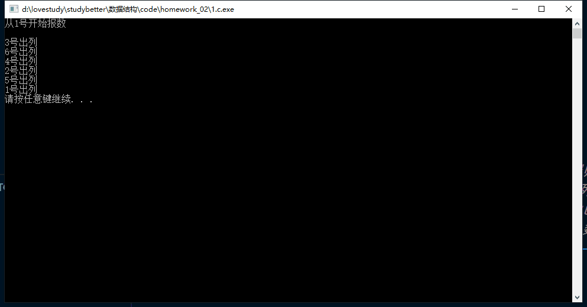

# C-language Environment Test

```c
//Solution for the Josephu problem

#include <stdio.h>
#include <stdlib.h>

void Solve(int *J, int n, int m, int k)
{
    int i = k - 1;
    int s = 0; //计数器
    int f = 0; //记录出列人数

    while (f < n)
    {
        if (i > n - 1)
            i = 0;     //模拟与表头连接
        if (J[i] == 1) //如果有人，报数
            s++;
        if (s == m) //报到指定数
        {
            s = 0;                       //报数归零
            printf("%d号出列\n", i + 1); //输出出列序号
            J[i] = 0;                    //标记为空
            f++;                         //出列人数+1
        }
        i++;
    }
}

int main()
{
    int n = 6;
    int m = 3;
    int k = 1;
    int J[n];
    for (int i = 0; i < n; i++)
        J[i] = 1;

    printf("从%d号开始\n\n", k);
    Solve(J, n, m, k);

    //free(J);
    system("pause");
    return 0;
}
```

